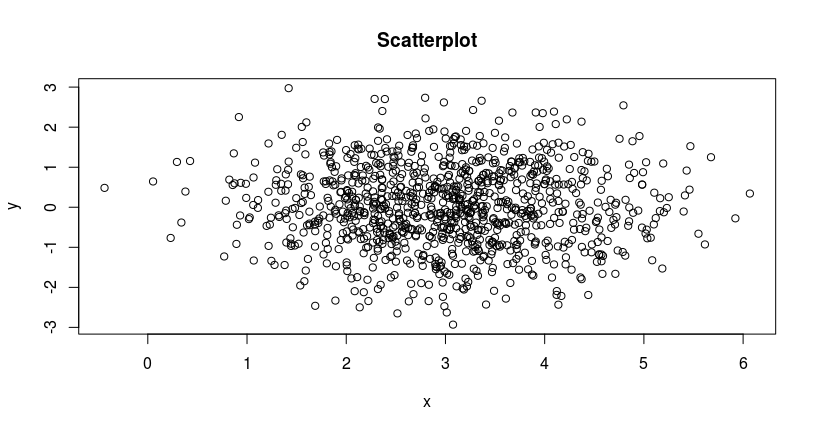

# Taller básico de R
Adolfo De Unánue T.  
30 de marzo de 2016  

# Introducción

## Mi nombre es...

- Adolfo De Unánue Tiscareño

- Director Académico de MCDatos - ITAM

- CTO Klustera

- CTO Grillo

## Repositorio

* Página: `https://github.com/nanounanue/xxvii-congreso-nacional-actuaria-udla/tree/master`

* Repo: `git@github.com:nanounanue/xxvii-congreso-nacional-actuaria-udla.git`

* [Descargar `zip`](https://github.com/nanounanue/xxvii-congreso-nacional-actuaria-udla/archive/master.zip)

# ¿Por qué R?

## Greg Snow, 2006 

Busses are very easy to use, you just need to know which bus to get on, where to get on,
and where to get off (and you need to pay your fare). Cars, on the other hand, require
much more work: you need to have some type of map or directions (even if the map is
in your head), you need to put gas in every now and then, you need to know the rules of
the road (have some type of drivers license). The big advantage of the car is that it can
take you a bunch of places that the bus does not go and it is quicker for some trips that
would require transferring between busses.

Using this analogy, programs like SPSS are busses, easy to use for the standard things,
but very frustrating if you want to do something that is not already preprogrammed.
R is a 4-wheel drive SUV (though environmentally friendly) with a bike on the back, a
kayak on top, good walking and running shoes in the passenger seat, and mountain
climbing and spelunking gear in the back.

R can take you anywhere you want to go if you take time to learn how to use the equipment,
but that is going to take longer than learning where the bus stops are in SPSS.


Tomado de **Hands on Programming with R** de *Garrent Grolemund*


## Algunas características de R


* Lenguaje estadístico.
* Gráficas, manipulación de datos.
* Miles de paquetes de algoritmos estadísticos, aprendizaje de máquina, minería.
* Soporte para Hadoop, Big data, Multiprocesador, ejecución en paralelo.
* ¡Conexión con casi todo!
* Geoespacial, series de tiempo, bases de datos, etc.
* Reportes y presentaciones automáticos (¡esta presentación por ejemplo!)


# RStudio: quicktour

# REPL: glimpse

## REPL

**R**ead

**E**valuate

**P**rint

**L**oop

# R vs ...

# Bases del Lenguaje

## En `R` todo son

* Objetos
    * Pueden ser vistos como un espacio de almacenamiento y un nombre asociado a ello.
    * Todo está  en la memoria de la computadora (por el momento).

* Funciones
    * Tipo especial de objeto.
    * Realiza ciertas operaciones, toma algunos argumentos y produce un resultado de la realización de las operaciones.


## Asignación

* Los objetos y funciones se almacenan usando el operador de asignación `<-`


```r
x <- 1345
y <- 2
```


* Si queremos ver lo que esta almacenado tecleamos su nombre.


```r
  x
```

```
## [1] 1345
```

```r
  y
```

```
## [1] 2
```

## ¿Qué hay ahí?

* Si queremos ver todos los objetos en memoria: `ls()` u `objects()`


```r
ls()
```

```
## [1] "x" "y"
```


## Vectores

Un vector es un conjunto ordenado de cosas, la función para **crearlo** es `c()` de _concatenar_ ...


```r
v <- c(4, 18, 23.6, 23)
v
```

```
## [1]  4.0 18.0 23.6 23.0
```

Una característica importante del vector es su longitud


```r
length(v)
```

```
## [1] 4
```

## Vectores

Es posible generar vectores como _secuencias_:


```r
x <- 1:10
x
```

```
##  [1]  1  2  3  4  5  6  7  8  9 10
```

```r
10:15 - 1 ## ¿Qué pasó aquí?
```

```
## [1]  9 10 11 12 13 14
```


```r
10:(15 - 1) ## Mucho mejor
```

```
## [1] 10 11 12 13 14
```

## Vectores

Se pueden generar secuencias que no sean enteros


```r
seq(from = -4, to=3, by = 0.5)
```

```
##  [1] -4.0 -3.5 -3.0 -2.5 -2.0 -1.5 -1.0 -0.5  0.0  0.5  1.0  1.5  2.0  2.5
## [15]  3.0
```


```r
seq(from = 1, to = 5, length = 3)
```

```
## [1] 1 3 5
```


```r
seq(length = 10, from = -1, by = 0.2)
```

```
##  [1] -1.0 -0.8 -0.6 -0.4 -0.2  0.0  0.2  0.4  0.6  0.8
```

## Vectores

También se puede crear _repitiendo_ un elemento:


```r
rep(5, 8)
```

```
## [1] 5 5 5 5 5 5 5 5
```


```r
rep("character", 5)
```

```
## [1] "character" "character" "character" "character" "character"
```


## Vectores

Los elementos del vector se pueden obtener mediante el índice


```r
v[2]
```

```
## [1] 18
```

_Nota que en_ `R` el índice empieza en `1`.


```r
v[1] <- "¡hola!"
v
```

```
## [1] "¡hola!" "18"     "23.6"   "23"
```

Y podemos agregar nuevos elementos


```r
v[length(v) + 1] <- -45
v
```

```
## [1] "¡hola!" "18"     "23.6"   "23"     "-45"
```

## Vectores

Las operaciones sobre vectores están optimizadas, en el _caló_ de `R` se dice que están _vectorizadas_.


```r
v <- c(2, 3, 4, 6)
x <- sqrt(v)
x
```

```
## [1] 1.414214 1.732051 2.000000 2.449490
```

Operan elemento por elemento, por lo que los vectores en `R` **no** son los vectores de las clases de mate.

Por ejemplo, estas operaciones no tienen sentido para vectores matemáticos:


```r
v + 1
```

```
## [1] 3 4 5 7
```


```r
v == c(1,3,5,7)
```

```
## [1] FALSE  TRUE FALSE FALSE
```

## Vectores

Otra característica es que hay un _roll-up_ de vectores


```r
v1 <- c(4, 6, 87)
v2 <- c(2,10)
v1+v2 
```

```
## Warning in v1 + v2: longitud de objeto mayor no es múltiplo de la longitud
## de uno menor
```

```
## [1]  6 16 89
```

¿Puedes ver que pasó?

## Vectores

Una de las operaciones que uno quiere realizar cuando analiza datos es el _filtrado_, por ejemplo, quiero ver cuales son positivos


```r
x <- c(1, -3, -2, 4, -10, 2, 3, 90)
x > 0
```

```
## [1]  TRUE FALSE FALSE  TRUE FALSE  TRUE  TRUE  TRUE
```

Entonces, puedo utilizar este índice lógico, para _extraer_ o _filtrar_ los positivos:


```r
x[x>0]
```

```
## [1]  1  4  2  3 90
```

o los mayores de `2`


```r
x[x > 2]
```

```
## [1]  4  3 90
```

## Vectores

Los índices en `R` son más versátiles que en otros lenguajes, por ejemplo, es posible usar _índices vectoriales_


```r
x
```

```
## [1]   1  -3  -2   4 -10   2   3  90
```

```r
x[c(4, 2)]
```

```
## [1]  4 -3
```

## Vectores

Lo que sigue, es muy intuitivo, pero pude confundirte si has programado en `python`. El índice _negativo_ **remueve**


```r
x
```

```
## [1]   1  -3  -2   4 -10   2   3  90
```

```r
x[-1]
```

```
## [1]  -3  -2   4 -10   2   3  90
```


```r
x[-c(1, 5)]
```

```
## [1] -3 -2  4  2  3 90
```

Nota como ninguna operación de filtrado _modifica_ el vector original `x`.

## Vectores

Hasta ahora hemos visto vectores numéricos, pero pueden ser de cualquier tipo:


```r
flotantes <- c(1.1, 1.3, .4)
flotantes
```

```
## [1] 1.1 1.3 0.4
```


```r
letras <- c('a', 'b', 'c')
letras
```

```
## [1] "a" "b" "c"
```


```r
hoy <- Sys.Date()
(fechas <- seq(hoy, length.out=10, by = "1 week"))
```

```
##  [1] "2016-03-30" "2016-04-06" "2016-04-13" "2016-04-20" "2016-04-27"
##  [6] "2016-05-04" "2016-05-11" "2016-05-18" "2016-05-25" "2016-06-01"
```


## Vectores

Pero si los mezclas, ocurre una operación de _transformación_ o _casting_ al elemento más complejo.


```r
enteros <- c(1, 2, 3)
enteros
```

```
## [1] 1 2 3
```

```r
enteros <- c(1,2,3, 4.1)
enteros
```

```
## [1] 1.0 2.0 3.0 4.1
```

```r
enteros <- c(1,2,3, "a")
enteros
```

```
## [1] "1" "2" "3" "a"
```

## Vectores

El vector se puede analizar rápidamente, si es numérico usando lo siguiente:


```r
x <- c(1,2,3,4,5,6)
sum(x) # Total
```

```
## [1] 21
```

```r
mean(x) # Promedio
```

```
## [1] 3.5
```

```r
sd(x) # Desviación estándar
```

```
## [1] 1.870829
```

```r
summary(x) # O una descripción estadística completa
```

```
##    Min. 1st Qu.  Median    Mean 3rd Qu.    Max. 
##    1.00    2.25    3.50    3.50    4.75    6.00
```

## Vectores

Y se puede analizar visualmente también:


```r
names(x) <- c("algo", "otro", "manzanas", "peras", "quesos", "jitomates")
barplot(x) 
```

\

## Vectores

Si tienes dos variables


```r
y <- rnorm(1000, mean= 0, sd=1)  # Genero números aleatorios distribuidos normalmente (*)
x <- rnorm(1000, mean=3, sd=1)
plot(x,y, main="Scatterplot")
```

\


## Vectores

Por último, es posible preguntar si un objeto es un vector:


```r
is.vector(x)
```

```
## [1] TRUE
```

```r
is.numeric(x)
```

```
## [1] TRUE
```

```r
is.character(x)
```

```
## [1] FALSE
```


## Factores

Cuando uno quiere analizar datos, regularmente necesita variables que funcionan como etiquetas. Estas etiquetas pueden ser contadas, pero no sumadas. A este tipo de variables se les conoce como variables _categóricas_ y en `R` se llaman **factores**.

Es posible crearlas a partir de un `vector`


```r
f <- c("M", "F", "M", "M", "F", "M")
f <- factor(f)
f
```

```
## [1] M F M M F M
## Levels: F M
```

Y pueden tener una descripción larga (`label`)


```r
f <- factor(c("M", "F", "M", "M", "F", "M", "F"), levels=c("M", "F"), labels=c("Hombre", "Mujer"))
f
```

```
## [1] Hombre Mujer  Hombre Hombre Mujer  Hombre Mujer 
## Levels: Hombre Mujer
```


## Factores

Hagámos una copia de `f`


```r
g <- f
g
```

```
## [1] Hombre Mujer  Hombre Hombre Mujer  Hombre Mujer 
## Levels: Hombre Mujer
```

```r
f
```

```
## [1] Hombre Mujer  Hombre Hombre Mujer  Hombre Mujer 
## Levels: Hombre Mujer
```

## Factores

Los `levels` se pueden extraer con la siguiente función:


```r
levels(g)
```

```
## [1] "Hombre" "Mujer"
```

## Factores

¿Qué pasa si quiero agregar un nuevo elemento al final del factor?


```r
g[length(g)+1] <- "NR"
```

```
## Warning in `[<-.factor`(`*tmp*`, length(g) + 1, value = "NR"): invalid
## factor level, NA generated
```

```r
g
```

```
## [1] Hombre Mujer  Hombre Hombre Mujer  Hombre Mujer  <NA>  
## Levels: Hombre Mujer
```

Mmmm, como el _nivel_ `NR` no estaba definido, lo agrega como un valor inexistente (`NA`).

## Factores


```r
g <- factor(c("a", "b", "a", "a", "b", "b", "b"), levels=c("a", "b", "c"))
g
```

```
## [1] a b a a b b b
## Levels: a b c
```


```r
g[length(g)+1] <- "c"
g
```

```
## [1] a b a a b b b c
## Levels: a b c
```

## Factores

Una tabla con los conteos por nivel se puede obtener fácilmente


```r
table(g)
```

```
## g
## a b c 
## 3 4 1
```

## Factores


```r
a <- factor(c("estudiante", "profesor", "estudiante", "profesor", "estudiante", "estudiante", "estudiante"))
a
```

```
## [1] estudiante profesor   estudiante profesor   estudiante estudiante
## [7] estudiante
## Levels: estudiante profesor
```

Es posible mezclar los dos factores en una tabla 


```r
t <- table(a,f)
t
```

```
##             f
## a            Hombre Mujer
##   estudiante      3     2
##   profesor        1     1
```

Nota como se le está asignando el género por renglón.

## Factores

Una tabla marginal, es aquella que resume los conteos por dimensión o _margen_


```r
margin.table(t, 1)
```

```
## a
## estudiante   profesor 
##          5          2
```

```r
margin.table(t,2)
```

```
## f
## Hombre  Mujer 
##      4      3
```

## Factores

Y una tabla de _proporciones_ nos da (obviamente) la proporción


```r
prop.table(t, 2) 
```

```
##             f
## a               Hombre     Mujer
##   estudiante 0.7500000 0.6666667
##   profesor   0.2500000 0.3333333
```

## Factores

LA representación visual de un factor es una gráfica de barras


```r
plot(f, main = "Género")
```

\


## Listas

Otro tipo de objeto son las _listas_, son parecidas a los vectores, pero con una diferencia importante: pueden tener los elementos de diferentes tipos.


```r
lista <- list(1, 2, 3, 4, 5)
lista
```

```
## [[1]]
## [1] 1
## 
## [[2]]
## [1] 2
## 
## [[3]]
## [1] 3
## 
## [[4]]
## [1] 4
## 
## [[5]]
## [1] 5
```

## Listas

El operador de extracción (`[`), devuelve una _lista_


```r
lista[1]
```

```
## [[1]]
## [1] 1
```

```r
is.list(lista[1])
```

```
## [1] TRUE
```

```r
is.vector(lista[1])
```

```
## [1] TRUE
```


## Listas

El operador `[[` devuelve un _vector_


```r
lista[[1]]
```

```
## [1] 1
```

```r
is.list(lista[[1]])
```

```
## [1] FALSE
```

```r
is.vector(lista[[1]])
```

```
## [1] TRUE
```

## Listas

Como mencioné es posible tener varios tipos de datos mezclados en una lista (¿Puedes identificarlos?)


```r
edificio <- list(direccion="Dinamarca 73", dimensiones=c(10, 15, 2.5), renta.mensual=6300)
edificio
```

```
## $direccion
## [1] "Dinamarca 73"
## 
## $dimensiones
## [1] 10.0 15.0  2.5
## 
## $renta.mensual
## [1] 6300
```

## Listas

Existe otro operador de acceso: `$` 


```r
edificio$renta.mensual
```

```
## [1] 6300
```

```r
edificio[3]
```

```
## $renta.mensual
## [1] 6300
```

```r
edificio[[3]]
```

```
## [1] 6300
```

## Listas


```r
names(edificio)
```

```
## [1] "direccion"     "dimensiones"   "renta.mensual"
```

Se pueden agregar elementos a la lista


```r
edificio$dueños <- c("Ana", "Miguel")
names(edificio)
```

```
## [1] "direccion"     "dimensiones"   "renta.mensual" "dueños"
```

## Listas

Al igual que en el caso de los vectores, el índice negativo **remueve**


```r
edificio <- edificio[-3]
edificio
```

```
## $direccion
## [1] "Dinamarca 73"
## 
## $dimensiones
## [1] 10.0 15.0  2.5
## 
## $dueños
## [1] "Ana"    "Miguel"
```


## Data frames

* Se podría argumentar, que cuando se piensa en análisis de datos, se piensa en "tablas" o en "bases de datos", la característica común es que son objetos rectangulares (de dos dimensiones).

* `R` proveé una abstración para los datos en formato rectangular llamado `data.frame`


```r
df <- data.frame(var.1=c('A', 'B', 'C', 'A'), var.2=c('hola', 'adios', 'ciao', 'juan'), var.3=c(1, 2, 3, 4.5))
df
```

```
##   var.1 var.2 var.3
## 1     A  hola   1.0
## 2     B adios   2.0
## 3     C  ciao   3.0
## 4     A  juan   4.5
```

## Data frames

La extracción ahora debe de hacerse en dos dimensiones (renglones, columnas)


```r
df[3,1]
```

```
## [1] C
## Levels: A B C
```

Extraer un renglón


```r
df[3,]
```

```
##   var.1 var.2 var.3
## 3     C  ciao     3
```


## Data frames

Extraer una columna


```r
df[,3]
```

```
## [1] 1.0 2.0 3.0 4.5
```

Se puede utilizar el nombre de la columna para extraer la columna completa


```r
df$var.3
```

```
## [1] 1.0 2.0 3.0 4.5
```


## Data frames

La extracción "mágica" se preserva también en los `data.frame`s


```r
df[df$var.3 > 2,]
```

```
##   var.1 var.2 var.3
## 3     C  ciao   3.0
## 4     A  juan   4.5
```


```r
df[df$var.1 == "A", "var.3"]
```

```
## [1] 1.0 4.5
```

## Data frames

Así como los vectores (y sus derivados) tenían longitud, los `data.frame`s tiene **tamaño** y es bidimensional


```r
dim(df)
```

```
## [1] 4 3
```


```r
nrow(df)
```

```
## [1] 4
```

```r
ncol(df)
```

```
## [1] 3
```


```r
names(df)
```

```
## [1] "var.1" "var.2" "var.3"
```

# Manipulando fechas: `lubridate`

## Instalación


```r
if(!require(lubridate)){
    install.packages('lubridate', dependencies = TRUE, repos = "http://cran.us.r-project.org")
    library(lubridate)
}
```

```
## Loading required package: lubridate
```

## `lubridate`

- Las fechas son uno de los jinetes del apocalipsis
    - Más bien, lo que resulta de capturar fechas (Diferentes formatos, Timezones)
    - Y manipularlas (intervalos, sumas, diferencias, extracción)

- Además son el tipo de datos primordial de las series de tiempo

- `lubridate` trata de solucionar esto

- `lubridate` soporta *instantes*, *intervalos*, *duraciones* y *periodos*

## Zonas horarias

Esa fecha que está en el *data set* ¿Es en la hora del servidor? ¿Del dispositivo? ¿Local?


## Ejemplos


```r
# Convertir cadenas en fechas
ymd('20160330') # Nota el TZ
```

```
## [1] "2016-03-30 UTC"
```

```r
dmy('30032016')
```

```
## [1] "2016-03-30 UTC"
```

```r
mdy_hm('033020161600') # ¡Esta no es la hora a la que empezó el taller!
```

```
## [1] "2016-03-30 16:00:00 UTC"
```

```r
mdy_hm('033020161600', tz='America/Mexico_City') # Mucho mejor
```

```
## [1] "2016-03-30 16:00:00 CST"
```


La lista de zonas horarias se puede ver [aquí](https://en.wikipedia.org/wiki/List_of_tz_database_time_zones).

## Ejemplos


```r
# Instantes
(inicio_taller <- dmy_hm('300320161600', tz='America/Mexico_City'))
```

```
## [1] "2016-03-30 16:00:00 CST"
```

```r
(fin_taller <- dmy_hm('300320161800', tz='America/Mexico_City'))
```

```
## [1] "2016-03-30 18:00:00 CST"
```

## Ejemplos


```r
# Extracción
day(inicio_taller)
```

```
## [1] 30
```

```r
month(inicio_taller,label = TRUE, abbr=FALSE)
```

```
## [1] March
## 12 Levels: January < February < March < April < May < June < ... < December
```

```r
year(inicio_taller)
```

```
## [1] 2016
```

```r
wday(inicio_taller,label = TRUE, abbr=TRUE)
```

```
## [1] Wed
## Levels: Sun < Mon < Tues < Wed < Thurs < Fri < Sat
```


## Ejemplos


```r
# Intervalos: Un lapso de tiempo que ocurre entre dos instantes
(taller_basico <- interval(inicio_taller, fin_taller))
```

```
## [1] 2016-03-30 16:00:00 CST--2016-03-30 18:00:00 CST
```

```r
int_start(taller_basico) 
```

```
## [1] "2016-03-30 16:00:00 CST"
```

```r
int_length(taller_basico) ## Segundos
```

```
## [1] 7200
```

## Ejemplos


```r
fin_taller - inicio_taller ## difftime
```

```
## Time difference of 2 hours
```

```r
inicio_receso <- dmy_hm('300320161700', tz='America/Mexico_City')
inicio_receso %within% taller_basico
```

```
## [1] TRUE
```

## Ejemplos


```r
# Duración: Como un intervalo, pero sin estar anclado
# Buenos para hacer aritmética de fechas
dweeks(1) # 1 semana
```

```
## [1] "604800s (~7 days)"
```

```r
inicio_receso + dminutes(10)
```

```
## [1] "2016-03-30 17:10:00 CST"
```

```r
round_date(inicio_taller, unit = 'month') # ¿Era lo que esperabas?
```

```
## [1] "2016-04-01 CST"
```


# Limpiando cadenas: `stringr`

## Instalación


```r
if(!require(stringr)){
    install.packages('stringr', dependencies = TRUE, repos = "http://cran.us.r-project.org")
    library(stringr)
}
```

```
## Loading required package: stringr
```

## ¿Por qué?

- Muchas fuentes de datos tendrán columnas que son cadenas de caracteres y quizá necesitemos manipularlas.

- *Text mining*

- Manipulación con expresiones regulares `regex`


## `RegEx`: Básicos

- Pensar en patrones (*patterns*).
- Operadores básicos
  - `OR`: `gato|gata` hará *match* con gato o gata.
  - Agrupamiento o precedencia de operadores, `gat(a|o)` tiene el mismo significado que `gato|gata`.
  - Cuantificadores: `?` (0 ó 1), `+` (uno ó más), `*` (cero ó más).
- `^` Inicio de renglón, `$` fin de renglón.

## `RegEx`: Básicos

- Expresiones básicas
  - `.` Cualquier carácter.
  - `[ ]` Cualquier carácter incluido en los corchetes, e.g. `[xyz]`, `[a-zA-Z0-9-]`.
  - `[^ ]` Cualquier caracter individual que n esté en los corchetes, e.g. `[^abc]`. También puede indicar inicio de líınea (fuera de los corchetes.).

- `\( \)` ó `( )` crea una subexpresión que luego puede ser invocada con `\n` donde `n` es el número de la subexpresión.

- `{m,n}` Repite lo anterior un número de al menos `m` veces pero no mayor a `n` veces.

- `\b` representa el límite de palabra.


## `RegEx`: Ejemplos

- username: `[a-z0-9 -]{3,16}`

- contraseña: `[a-z0-9 -]{6,18}`

- IP address: `(25[0-5]|2[0-4][0-9]|[01]?[0-9][0-9]?\.){3}(25[0-5]|2[0-4][0-9]|[01]?[0-9][0-9]?)`

- fecha (`dd/mm/yyyy`): ???

- email (`adolfo@itam.edu`) : ???

- URL (`http://gmail.com`): ???


## Ejemplos

Con esta cadena haremos varias manipulaciones:


```r
cadena <- "Cadena de ejemplo. A veces se le llama STRING. Y puede tener todo lo que quieran como fechas: 04/02/1978 o números: 23.578 o incluisive pesos: $32 MXP."
```

```r
## Convertir a minúsculas
stringr::str_to_lower(cadena)
```

```
## [1] "cadena de ejemplo. a veces se le llama string. y puede tener todo lo que quieran como fechas: 04/02/1978 o números: 23.578 o incluisive pesos: $32 mxp."
```


```r
## Pegar cadenas
otra_cadena <- "Esta cadena es anexa."

paste(cadena, otra_cadena, sep = "###")
```

```
## [1] "Cadena de ejemplo. A veces se le llama STRING. Y puede tener todo lo que quieran como fechas: 04/02/1978 o números: 23.578 o incluisive pesos: $32 MXP.###Esta cadena es anexa."
```

## ¿Qué podemos hacer con `regex`?

- Identificar un *match* con un patrón (`pattern`)
    - `grep(..., value = FALSE)`, `stringr::str_detect`
- Extraer un *match* con un patrón
    - `grep(..., value=TRUE)`, `stringr::str_extract`, `stringr::str_extract_all`
- Localizar un patrón en una cadena
    - `stringr::str_locate`, `stringr::str_extract_all`,
- Reemplazar un patrón
    - `stringr::str_replace`, `stringr::str_replace_all`, `gsub`
- Partir una cadena usando un patrón
    - `stringr::str_split`, `strsplit`


## Ejemplos


```r
## Dividiendo por palabras
stringr::str_split(string = cadena, pattern = " ")  
```

```
## [[1]]
##  [1] "Cadena"     "de"         "ejemplo."   "A"          "veces"     
##  [6] "se"         "le"         "llama"      "STRING."    "Y"         
## [11] "puede"      "tener"      "todo"       "lo"         "que"       
## [16] "quieran"    "como"       "fechas:"    "04/02/1978" "o"         
## [21] "números:"   "23.578"     "o"          "incluisive" "pesos:"    
## [26] "$32"        "MXP."
```

```r
## pattern es una expresión regular ...
```


```r
## Extrayendo las fechas del texto
stringr::str_extract_all(string=cadena, pattern="[0-9]{1,2}/[0-9]{1,2}/[0-9]{4}")[[1]]
```

```
## [1] "04/02/1978"
```
## Ejemplos


```r
## Substituyendo
stringr::str_replace_all(string=cadena, pattern = "\\$([0-9]*) MXP", replacement = "\\1 pesos mexicanos")
```

```
## [1] "Cadena de ejemplo. A veces se le llama STRING. Y puede tener todo lo que quieran como fechas: 04/02/1978 o números: 23.578 o incluisive pesos: 32 pesos mexicanos."
```


```r
## Un ejemplo ligeramente más complicado
fecha <- stringr::str_split(stringr::str_extract(cadena, "[0-9]{1,2}/[0-9]{1,2}/[0-9]{4}"), "/")[[1]]
names(fecha) <- c("dia", "mes", "año")
fecha
```

```
##    dia    mes    año 
##   "04"   "02" "1978"
```


# Ajustando datos: `tidyr`

## Instalación


```r
if(!require(tidyr)){
    install.packages('tidyr', dependencies = TRUE, repos = "http://cran.us.r-project.org")
    library(tidyr)
}
```

```
## Loading required package: tidyr
```

## ¿Qué es un *dataset* `tidy`?

Son conjuntos de datos ordenados en la siguiente forma

Físicamente | Significado
------------|-------------
Tabla/archivo| *Data set*
Filas        | Observación
Columnas     | Variables
Celda        | Valor

- Datos en este ordenamiento son más fáciles de manipular, graficar y analizar.

- Cada columna será un vector atómico y podremos aprovechar las operaciones vectorizadas de `R`

## `tidyr`

- Nos permite manipular datos para que tengan la forma `tidy`

- Tiene cuatro funciones principales

    - `gather`: Convierte *data sets* de formato *wide* a *long*
    - `spread`: Convierte *data sets* de formato *long* a *wide*
    - `unite`: Junta dos o más columnas
    - `separate`: Divide una columna en dos o más

## Ejemplos

- Usaremos la base de datos de `mtcars`


```r
data(mtcars)
?mtcars
head(mtcars)
```

```
##                    mpg cyl disp  hp drat    wt  qsec vs am gear carb
## Mazda RX4         21.0   6  160 110 3.90 2.620 16.46  0  1    4    4
## Mazda RX4 Wag     21.0   6  160 110 3.90 2.875 17.02  0  1    4    4
## Datsun 710        22.8   4  108  93 3.85 2.320 18.61  1  1    4    1
## Hornet 4 Drive    21.4   6  258 110 3.08 3.215 19.44  1  0    3    1
## Hornet Sportabout 18.7   8  360 175 3.15 3.440 17.02  0  0    3    2
## Valiant           18.1   6  225 105 2.76 3.460 20.22  1  0    3    1
```

## Ejemplos

Nota como el nombre del carro **no** es una columna, es el *nombre del renglón*. Arreglemos eso.


```r
mtcars$car <- rownames(mtcars) # Agregamos la columna car
mtcars <- mtcars[,c(12, 1:11)] # Reordenamos las columnas
row.names(mtcars) <- NULL  # Removemos los rownames
head(mtcars)
```

```
##                 car  mpg cyl disp  hp drat    wt  qsec vs am gear carb
## 1         Mazda RX4 21.0   6  160 110 3.90 2.620 16.46  0  1    4    4
## 2     Mazda RX4 Wag 21.0   6  160 110 3.90 2.875 17.02  0  1    4    4
## 3        Datsun 710 22.8   4  108  93 3.85 2.320 18.61  1  1    4    1
## 4    Hornet 4 Drive 21.4   6  258 110 3.08 3.215 19.44  1  0    3    1
## 5 Hornet Sportabout 18.7   8  360 175 3.15 3.440 17.02  0  0    3    2
## 6           Valiant 18.1   6  225 105 2.76 3.460 20.22  1  0    3    1
```

## Ejemplo

Convertimos a *long* usando `car` como pivote.


```r
head(gather(mtcars, variable, value, -car))
```

```
##                 car variable value
## 1         Mazda RX4      mpg  21.0
## 2     Mazda RX4 Wag      mpg  21.0
## 3        Datsun 710      mpg  22.8
## 4    Hornet 4 Drive      mpg  21.4
## 5 Hornet Sportabout      mpg  18.7
## 6           Valiant      mpg  18.1
```

También podemos tener más columnas como pivote


```r
head(gather(mtcars, variable, value, mpg:gear))
```

```
##                 car carb variable value
## 1         Mazda RX4    4      mpg  21.0
## 2     Mazda RX4 Wag    4      mpg  21.0
## 3        Datsun 710    1      mpg  22.8
## 4    Hornet 4 Drive    1      mpg  21.4
## 5 Hornet Sportabout    2      mpg  18.7
## 6           Valiant    1      mpg  18.1
```

## Ejemplo


```r
mtcars_long <- gather(mtcars, variable, value, -car)

head(spread(mtcars_long, variable, value))  # Lo regresamos a su forma original
```

```
##                  car am carb cyl disp drat gear  hp  mpg  qsec vs    wt
## 1        AMC Javelin  0    2   8  304 3.15    3 150 15.2 17.30  0 3.435
## 2 Cadillac Fleetwood  0    4   8  472 2.93    3 205 10.4 17.98  0 5.250
## 3         Camaro Z28  0    4   8  350 3.73    3 245 13.3 15.41  0 3.840
## 4  Chrysler Imperial  0    4   8  440 3.23    3 230 14.7 17.42  0 5.345
## 5         Datsun 710  1    1   4  108 3.85    4  93 22.8 18.61  1 2.320
## 6   Dodge Challenger  0    2   8  318 2.76    3 150 15.5 16.87  0 3.520
```

## Ejemplo


```r
(mtcars <- separate(mtcars, car, sep = ' ', into = c('marca'), remove=FALSE))
```

```
## Warning: Too many values at 31 locations: 1, 2, 3, 4, 5, 7, 8, 9, 10, 11,
## 12, 13, 14, 15, 16, 17, 18, 19, 20, 21, ...
```

```
##                    car    marca  mpg cyl  disp  hp drat    wt  qsec vs am
## 1            Mazda RX4    Mazda 21.0   6 160.0 110 3.90 2.620 16.46  0  1
## 2        Mazda RX4 Wag    Mazda 21.0   6 160.0 110 3.90 2.875 17.02  0  1
## 3           Datsun 710   Datsun 22.8   4 108.0  93 3.85 2.320 18.61  1  1
## 4       Hornet 4 Drive   Hornet 21.4   6 258.0 110 3.08 3.215 19.44  1  0
## 5    Hornet Sportabout   Hornet 18.7   8 360.0 175 3.15 3.440 17.02  0  0
## 6              Valiant  Valiant 18.1   6 225.0 105 2.76 3.460 20.22  1  0
## 7           Duster 360   Duster 14.3   8 360.0 245 3.21 3.570 15.84  0  0
## 8            Merc 240D     Merc 24.4   4 146.7  62 3.69 3.190 20.00  1  0
## 9             Merc 230     Merc 22.8   4 140.8  95 3.92 3.150 22.90  1  0
## 10            Merc 280     Merc 19.2   6 167.6 123 3.92 3.440 18.30  1  0
## 11           Merc 280C     Merc 17.8   6 167.6 123 3.92 3.440 18.90  1  0
## 12          Merc 450SE     Merc 16.4   8 275.8 180 3.07 4.070 17.40  0  0
## 13          Merc 450SL     Merc 17.3   8 275.8 180 3.07 3.730 17.60  0  0
## 14         Merc 450SLC     Merc 15.2   8 275.8 180 3.07 3.780 18.00  0  0
## 15  Cadillac Fleetwood Cadillac 10.4   8 472.0 205 2.93 5.250 17.98  0  0
## 16 Lincoln Continental  Lincoln 10.4   8 460.0 215 3.00 5.424 17.82  0  0
## 17   Chrysler Imperial Chrysler 14.7   8 440.0 230 3.23 5.345 17.42  0  0
## 18            Fiat 128     Fiat 32.4   4  78.7  66 4.08 2.200 19.47  1  1
## 19         Honda Civic    Honda 30.4   4  75.7  52 4.93 1.615 18.52  1  1
## 20      Toyota Corolla   Toyota 33.9   4  71.1  65 4.22 1.835 19.90  1  1
## 21       Toyota Corona   Toyota 21.5   4 120.1  97 3.70 2.465 20.01  1  0
## 22    Dodge Challenger    Dodge 15.5   8 318.0 150 2.76 3.520 16.87  0  0
## 23         AMC Javelin      AMC 15.2   8 304.0 150 3.15 3.435 17.30  0  0
## 24          Camaro Z28   Camaro 13.3   8 350.0 245 3.73 3.840 15.41  0  0
## 25    Pontiac Firebird  Pontiac 19.2   8 400.0 175 3.08 3.845 17.05  0  0
## 26           Fiat X1-9     Fiat 27.3   4  79.0  66 4.08 1.935 18.90  1  1
## 27       Porsche 914-2  Porsche 26.0   4 120.3  91 4.43 2.140 16.70  0  1
## 28        Lotus Europa    Lotus 30.4   4  95.1 113 3.77 1.513 16.90  1  1
## 29      Ford Pantera L     Ford 15.8   8 351.0 264 4.22 3.170 14.50  0  1
## 30        Ferrari Dino  Ferrari 19.7   6 145.0 175 3.62 2.770 15.50  0  1
## 31       Maserati Bora Maserati 15.0   8 301.0 335 3.54 3.570 14.60  0  1
## 32          Volvo 142E    Volvo 21.4   4 121.0 109 4.11 2.780 18.60  1  1
##    gear carb
## 1     4    4
## 2     4    4
## 3     4    1
## 4     3    1
## 5     3    2
## 6     3    1
## 7     3    4
## 8     4    2
## 9     4    2
## 10    4    4
## 11    4    4
## 12    3    3
## 13    3    3
## 14    3    3
## 15    3    4
## 16    3    4
## 17    3    4
## 18    4    1
## 19    4    2
## 20    4    1
## 21    3    1
## 22    3    2
## 23    3    2
## 24    3    4
## 25    3    2
## 26    4    1
## 27    5    2
## 28    5    2
## 29    5    4
## 30    5    6
## 31    5    8
## 32    4    2
```


# Manipulando datos: `dplyr`

## Instalación


```r
if(!require(dplyr)){
    install.packages('dplyr', dependencies = TRUE, repos = "http://cran.us.r-project.org")
    library(dplyr)
}
```

```
## Loading required package: dplyr
```

```
## 
## Attaching package: 'dplyr'
```

```
## The following objects are masked from 'package:lubridate':
## 
##     intersect, setdiff, union
```

```
## The following objects are masked from 'package:stats':
## 
##     filter, lag
```

```
## The following objects are masked from 'package:base':
## 
##     intersect, setdiff, setequal, union
```

## `dplyr`

- Es una biblioteca que nos permite **transformar** *data sets*  para realizar análisis

- Sus funciones principales, reflejan los cinco verbos de la manipulación de datos:
    - `select`: Seleccionas columnas
    - `filter`: Seleccionas renglones
    - `mutate`: Cambias/Creas valores en las columnas
    - `arrange`: Ordenas las filas usando columnas
    - `summarize`: Cálculo de resúmenes
    
## `dplyr`

- Además de esas funciones tiene algunas más muy interesantes:
    - `tbl_df`: Mejora la presentación de un `data.frame` 
    - `rename`: Renombra columnas
    - `glimpse`: Estructura del `data.frame`
    - `group_by`: Agrupa el `data.frame` por columnas
    - `src_sqlite`, `src_postgres`, `src_mysql`: Permite hacer un *wrap* de una tabla en la base de datos como si fuera un `data.frame`
        - Soporta además `big query`, `hive`, `cloudera impala` etc.
    
## Ejemplo

Siguiendo con `mtcars`


```r
(mtcars_tbl <- tbl_df(mtcars))
```

```
## Source: local data frame [32 x 13]
## 
##                  car   marca   mpg   cyl  disp    hp  drat    wt  qsec
##                (chr)   (chr) (dbl) (dbl) (dbl) (dbl) (dbl) (dbl) (dbl)
## 1          Mazda RX4   Mazda  21.0     6 160.0   110  3.90 2.620 16.46
## 2      Mazda RX4 Wag   Mazda  21.0     6 160.0   110  3.90 2.875 17.02
## 3         Datsun 710  Datsun  22.8     4 108.0    93  3.85 2.320 18.61
## 4     Hornet 4 Drive  Hornet  21.4     6 258.0   110  3.08 3.215 19.44
## 5  Hornet Sportabout  Hornet  18.7     8 360.0   175  3.15 3.440 17.02
## 6            Valiant Valiant  18.1     6 225.0   105  2.76 3.460 20.22
## 7         Duster 360  Duster  14.3     8 360.0   245  3.21 3.570 15.84
## 8          Merc 240D    Merc  24.4     4 146.7    62  3.69 3.190 20.00
## 9           Merc 230    Merc  22.8     4 140.8    95  3.92 3.150 22.90
## 10          Merc 280    Merc  19.2     6 167.6   123  3.92 3.440 18.30
## ..               ...     ...   ...   ...   ...   ...   ...   ...   ...
## Variables not shown: vs (dbl), am (dbl), gear (dbl), carb (dbl)
```
## Ejemplo

Y su estructura


```r
glimpse(mtcars_tbl)
```

```
## Observations: 32
## Variables: 13
## $ car   (chr) "Mazda RX4", "Mazda RX4 Wag", "Datsun 710", "Hornet 4 Dr...
## $ marca (chr) "Mazda", "Mazda", "Datsun", "Hornet", "Hornet", "Valiant...
## $ mpg   (dbl) 21.0, 21.0, 22.8, 21.4, 18.7, 18.1, 14.3, 24.4, 22.8, 19...
## $ cyl   (dbl) 6, 6, 4, 6, 8, 6, 8, 4, 4, 6, 6, 8, 8, 8, 8, 8, 8, 4, 4,...
## $ disp  (dbl) 160.0, 160.0, 108.0, 258.0, 360.0, 225.0, 360.0, 146.7, ...
## $ hp    (dbl) 110, 110, 93, 110, 175, 105, 245, 62, 95, 123, 123, 180,...
## $ drat  (dbl) 3.90, 3.90, 3.85, 3.08, 3.15, 2.76, 3.21, 3.69, 3.92, 3....
## $ wt    (dbl) 2.620, 2.875, 2.320, 3.215, 3.440, 3.460, 3.570, 3.190, ...
## $ qsec  (dbl) 16.46, 17.02, 18.61, 19.44, 17.02, 20.22, 15.84, 20.00, ...
## $ vs    (dbl) 0, 0, 1, 1, 0, 1, 0, 1, 1, 1, 1, 0, 0, 0, 0, 0, 0, 1, 1,...
## $ am    (dbl) 1, 1, 1, 0, 0, 0, 0, 0, 0, 0, 0, 0, 0, 0, 0, 0, 0, 1, 1,...
## $ gear  (dbl) 4, 4, 4, 3, 3, 3, 3, 4, 4, 4, 4, 3, 3, 3, 3, 3, 3, 4, 4,...
## $ carb  (dbl) 4, 4, 1, 1, 2, 1, 4, 2, 2, 4, 4, 3, 3, 3, 4, 4, 4, 1, 2,...
```

## Ejemplo: Select


```r
# Columnas car y mpg
head(select(mtcars_tbl, car, mpg))
```

```
## Source: local data frame [6 x 2]
## 
##                 car   mpg
##               (chr) (dbl)
## 1         Mazda RX4  21.0
## 2     Mazda RX4 Wag  21.0
## 3        Datsun 710  22.8
## 4    Hornet 4 Drive  21.4
## 5 Hornet Sportabout  18.7
## 6           Valiant  18.1
```

## Ejemplo: Select


```r
# Columnas que no estén entre disp y gear
head(select(mtcars_tbl, -(disp:gear)))
```

```
## Source: local data frame [6 x 5]
## 
##                 car   marca   mpg   cyl  carb
##               (chr)   (chr) (dbl) (dbl) (dbl)
## 1         Mazda RX4   Mazda  21.0     6     4
## 2     Mazda RX4 Wag   Mazda  21.0     6     4
## 3        Datsun 710  Datsun  22.8     4     1
## 4    Hornet 4 Drive  Hornet  21.4     6     1
## 5 Hornet Sportabout  Hornet  18.7     8     2
## 6           Valiant Valiant  18.1     6     1
```

## Ejemplo: Select


```r
# Columnas que empiecen con 'c'
head(select(mtcars_tbl, starts_with('c')))
```

```
## Source: local data frame [6 x 3]
## 
##                 car   cyl  carb
##               (chr) (dbl) (dbl)
## 1         Mazda RX4     6     4
## 2     Mazda RX4 Wag     6     4
## 3        Datsun 710     4     1
## 4    Hornet 4 Drive     6     1
## 5 Hornet Sportabout     8     2
## 6           Valiant     6     1
```


## Ejemplo: Filter


```r
filter(mtcars_tbl, mpg > 19)
```

```
## Source: local data frame [17 x 13]
## 
##                 car   marca   mpg   cyl  disp    hp  drat    wt  qsec
##               (chr)   (chr) (dbl) (dbl) (dbl) (dbl) (dbl) (dbl) (dbl)
## 1         Mazda RX4   Mazda  21.0     6 160.0   110  3.90 2.620 16.46
## 2     Mazda RX4 Wag   Mazda  21.0     6 160.0   110  3.90 2.875 17.02
## 3        Datsun 710  Datsun  22.8     4 108.0    93  3.85 2.320 18.61
## 4    Hornet 4 Drive  Hornet  21.4     6 258.0   110  3.08 3.215 19.44
## 5         Merc 240D    Merc  24.4     4 146.7    62  3.69 3.190 20.00
## 6          Merc 230    Merc  22.8     4 140.8    95  3.92 3.150 22.90
## 7          Merc 280    Merc  19.2     6 167.6   123  3.92 3.440 18.30
## 8          Fiat 128    Fiat  32.4     4  78.7    66  4.08 2.200 19.47
## 9       Honda Civic   Honda  30.4     4  75.7    52  4.93 1.615 18.52
## 10   Toyota Corolla  Toyota  33.9     4  71.1    65  4.22 1.835 19.90
## 11    Toyota Corona  Toyota  21.5     4 120.1    97  3.70 2.465 20.01
## 12 Pontiac Firebird Pontiac  19.2     8 400.0   175  3.08 3.845 17.05
## 13        Fiat X1-9    Fiat  27.3     4  79.0    66  4.08 1.935 18.90
## 14    Porsche 914-2 Porsche  26.0     4 120.3    91  4.43 2.140 16.70
## 15     Lotus Europa   Lotus  30.4     4  95.1   113  3.77 1.513 16.90
## 16     Ferrari Dino Ferrari  19.7     6 145.0   175  3.62 2.770 15.50
## 17       Volvo 142E   Volvo  21.4     4 121.0   109  4.11 2.780 18.60
## Variables not shown: vs (dbl), am (dbl), gear (dbl), carb (dbl)
```
## Ejemplo: Filter


```r
filter(mtcars_tbl, mpg > 19 & wt > 2)
```

```
## Source: local data frame [13 x 13]
## 
##                 car   marca   mpg   cyl  disp    hp  drat    wt  qsec
##               (chr)   (chr) (dbl) (dbl) (dbl) (dbl) (dbl) (dbl) (dbl)
## 1         Mazda RX4   Mazda  21.0     6 160.0   110  3.90 2.620 16.46
## 2     Mazda RX4 Wag   Mazda  21.0     6 160.0   110  3.90 2.875 17.02
## 3        Datsun 710  Datsun  22.8     4 108.0    93  3.85 2.320 18.61
## 4    Hornet 4 Drive  Hornet  21.4     6 258.0   110  3.08 3.215 19.44
## 5         Merc 240D    Merc  24.4     4 146.7    62  3.69 3.190 20.00
## 6          Merc 230    Merc  22.8     4 140.8    95  3.92 3.150 22.90
## 7          Merc 280    Merc  19.2     6 167.6   123  3.92 3.440 18.30
## 8          Fiat 128    Fiat  32.4     4  78.7    66  4.08 2.200 19.47
## 9     Toyota Corona  Toyota  21.5     4 120.1    97  3.70 2.465 20.01
## 10 Pontiac Firebird Pontiac  19.2     8 400.0   175  3.08 3.845 17.05
## 11    Porsche 914-2 Porsche  26.0     4 120.3    91  4.43 2.140 16.70
## 12     Ferrari Dino Ferrari  19.7     6 145.0   175  3.62 2.770 15.50
## 13       Volvo 142E   Volvo  21.4     4 121.0   109  4.11 2.780 18.60
## Variables not shown: vs (dbl), am (dbl), gear (dbl), carb (dbl)
```

## Ejemplo: mutate


```r
# La columna am es horrible, arreglemos
mutate(mtcars_tbl, am_fix = ifelse(am==1, 'manual', 'automático'))
```

```
## Source: local data frame [32 x 14]
## 
##                  car   marca   mpg   cyl  disp    hp  drat    wt  qsec
##                (chr)   (chr) (dbl) (dbl) (dbl) (dbl) (dbl) (dbl) (dbl)
## 1          Mazda RX4   Mazda  21.0     6 160.0   110  3.90 2.620 16.46
## 2      Mazda RX4 Wag   Mazda  21.0     6 160.0   110  3.90 2.875 17.02
## 3         Datsun 710  Datsun  22.8     4 108.0    93  3.85 2.320 18.61
## 4     Hornet 4 Drive  Hornet  21.4     6 258.0   110  3.08 3.215 19.44
## 5  Hornet Sportabout  Hornet  18.7     8 360.0   175  3.15 3.440 17.02
## 6            Valiant Valiant  18.1     6 225.0   105  2.76 3.460 20.22
## 7         Duster 360  Duster  14.3     8 360.0   245  3.21 3.570 15.84
## 8          Merc 240D    Merc  24.4     4 146.7    62  3.69 3.190 20.00
## 9           Merc 230    Merc  22.8     4 140.8    95  3.92 3.150 22.90
## 10          Merc 280    Merc  19.2     6 167.6   123  3.92 3.440 18.30
## ..               ...     ...   ...   ...   ...   ...   ...   ...   ...
## Variables not shown: vs (dbl), am (dbl), gear (dbl), carb (dbl), am_fix
##   (chr)
```

## Ejemplo: mutate


```r
# Puedes utilizar 'am' en lugar de 'am_fix'
(mtcars_tbl<- mutate(mtcars_tbl, am = ifelse(am==1, 'manual', 'automático')))
```

```
## Source: local data frame [32 x 13]
## 
##                  car   marca   mpg   cyl  disp    hp  drat    wt  qsec
##                (chr)   (chr) (dbl) (dbl) (dbl) (dbl) (dbl) (dbl) (dbl)
## 1          Mazda RX4   Mazda  21.0     6 160.0   110  3.90 2.620 16.46
## 2      Mazda RX4 Wag   Mazda  21.0     6 160.0   110  3.90 2.875 17.02
## 3         Datsun 710  Datsun  22.8     4 108.0    93  3.85 2.320 18.61
## 4     Hornet 4 Drive  Hornet  21.4     6 258.0   110  3.08 3.215 19.44
## 5  Hornet Sportabout  Hornet  18.7     8 360.0   175  3.15 3.440 17.02
## 6            Valiant Valiant  18.1     6 225.0   105  2.76 3.460 20.22
## 7         Duster 360  Duster  14.3     8 360.0   245  3.21 3.570 15.84
## 8          Merc 240D    Merc  24.4     4 146.7    62  3.69 3.190 20.00
## 9           Merc 230    Merc  22.8     4 140.8    95  3.92 3.150 22.90
## 10          Merc 280    Merc  19.2     6 167.6   123  3.92 3.440 18.30
## ..               ...     ...   ...   ...   ...   ...   ...   ...   ...
## Variables not shown: vs (dbl), am (chr), gear (dbl), carb (dbl)
```

## Ejemplo: mutate


```r
# car no es un factor
(mtcars_tbl <- mutate(mtcars_tbl, car = as.factor(car)))
```

```
## Source: local data frame [32 x 13]
## 
##                  car   marca   mpg   cyl  disp    hp  drat    wt  qsec
##               (fctr)   (chr) (dbl) (dbl) (dbl) (dbl) (dbl) (dbl) (dbl)
## 1          Mazda RX4   Mazda  21.0     6 160.0   110  3.90 2.620 16.46
## 2      Mazda RX4 Wag   Mazda  21.0     6 160.0   110  3.90 2.875 17.02
## 3         Datsun 710  Datsun  22.8     4 108.0    93  3.85 2.320 18.61
## 4     Hornet 4 Drive  Hornet  21.4     6 258.0   110  3.08 3.215 19.44
## 5  Hornet Sportabout  Hornet  18.7     8 360.0   175  3.15 3.440 17.02
## 6            Valiant Valiant  18.1     6 225.0   105  2.76 3.460 20.22
## 7         Duster 360  Duster  14.3     8 360.0   245  3.21 3.570 15.84
## 8          Merc 240D    Merc  24.4     4 146.7    62  3.69 3.190 20.00
## 9           Merc 230    Merc  22.8     4 140.8    95  3.92 3.150 22.90
## 10          Merc 280    Merc  19.2     6 167.6   123  3.92 3.440 18.30
## ..               ...     ...   ...   ...   ...   ...   ...   ...   ...
## Variables not shown: vs (dbl), am (chr), gear (dbl), carb (dbl)
```

## Ejemplo: group_by y summarise


```r
mtcars_by_am <- group_by(mtcars_tbl, am) # Grouped data.frame
arrange(summarise(mtcars_by_am, am_count = n()), desc(am_count))
```

```
## Source: local data frame [2 x 2]
## 
##           am am_count
##        (chr)    (int)
## 1 automático       19
## 2     manual       13
```


```r
summarise(mtcars_by_am, mean_mpg = mean(mpg, na.rm=TRUE), max_wt = max(wt), min_wt=min(wt))
```

```
## Source: local data frame [2 x 4]
## 
##           am mean_mpg max_wt min_wt
##        (chr)    (dbl)  (dbl)  (dbl)
## 1 automático 17.14737  5.424  2.465
## 2     manual 24.39231  3.570  1.513
```

## Ejemplo: Varios


```r
# Renombramos la columna car
rename(mtcars_tbl, automóvil = car)
```

```
## Source: local data frame [32 x 13]
## 
##            automóvil   marca   mpg   cyl  disp    hp  drat    wt  qsec
##               (fctr)   (chr) (dbl) (dbl) (dbl) (dbl) (dbl) (dbl) (dbl)
## 1          Mazda RX4   Mazda  21.0     6 160.0   110  3.90 2.620 16.46
## 2      Mazda RX4 Wag   Mazda  21.0     6 160.0   110  3.90 2.875 17.02
## 3         Datsun 710  Datsun  22.8     4 108.0    93  3.85 2.320 18.61
## 4     Hornet 4 Drive  Hornet  21.4     6 258.0   110  3.08 3.215 19.44
## 5  Hornet Sportabout  Hornet  18.7     8 360.0   175  3.15 3.440 17.02
## 6            Valiant Valiant  18.1     6 225.0   105  2.76 3.460 20.22
## 7         Duster 360  Duster  14.3     8 360.0   245  3.21 3.570 15.84
## 8          Merc 240D    Merc  24.4     4 146.7    62  3.69 3.190 20.00
## 9           Merc 230    Merc  22.8     4 140.8    95  3.92 3.150 22.90
## 10          Merc 280    Merc  19.2     6 167.6   123  3.92 3.440 18.30
## ..               ...     ...   ...   ...   ...   ...   ...   ...   ...
## Variables not shown: vs (dbl), am (chr), gear (dbl), carb (dbl)
```

## Ejemplo: Varios


```r
# Ordenamos la tabla de mayor a menor en la columna mpg
arrange(mtcars_tbl, desc(mpg))
```

```
## Source: local data frame [32 x 13]
## 
##               car   marca   mpg   cyl  disp    hp  drat    wt  qsec    vs
##            (fctr)   (chr) (dbl) (dbl) (dbl) (dbl) (dbl) (dbl) (dbl) (dbl)
## 1  Toyota Corolla  Toyota  33.9     4  71.1    65  4.22 1.835 19.90     1
## 2        Fiat 128    Fiat  32.4     4  78.7    66  4.08 2.200 19.47     1
## 3     Honda Civic   Honda  30.4     4  75.7    52  4.93 1.615 18.52     1
## 4    Lotus Europa   Lotus  30.4     4  95.1   113  3.77 1.513 16.90     1
## 5       Fiat X1-9    Fiat  27.3     4  79.0    66  4.08 1.935 18.90     1
## 6   Porsche 914-2 Porsche  26.0     4 120.3    91  4.43 2.140 16.70     0
## 7       Merc 240D    Merc  24.4     4 146.7    62  3.69 3.190 20.00     1
## 8      Datsun 710  Datsun  22.8     4 108.0    93  3.85 2.320 18.61     1
## 9        Merc 230    Merc  22.8     4 140.8    95  3.92 3.150 22.90     1
## 10  Toyota Corona  Toyota  21.5     4 120.1    97  3.70 2.465 20.01     1
## ..            ...     ...   ...   ...   ...   ...   ...   ...   ...   ...
## Variables not shown: am (chr), gear (dbl), carb (dbl)
```

# Graficando: `ggplot`

## Instalación
    

```r
if(!require(ggplot2) | !require(ggthemes)){
    install.packages(c('ggplot2', 'ggthemes'), dependencies = TRUE, repos = "http://cran.us.r-project.org")
    library(ggplot2)
    library(ggthemes)
}
```

```
## Loading required package: ggplot2
```

```
## Loading required package: ggthemes
```

## `ggplot`

- Define una **gramática** para *construir* gráficas.

- Hay que pensarlo como bloques de *lego* o *capas*

## Ejemplos


```r
ggplot(mtcars, aes(x=car, y=mpg)) + geom_bar(stat ='identity')
```

\


## Ejemplos


```r
## Mas capas
ggplot(mtcars, aes(x=car, y=mpg)) + geom_bar(stat ='identity', fill="#005533") +
    labs(x = 'Automóvil', y='Millas por galón', title='MPG vs Automóvil') +
    theme(axis.text.x = element_text(angle=90, hjust=1.0, size=9)) +
    theme_hc() # Tema ver ?ggthemes
```

## Ejemplos

\


## Ejemplos


```r
## Scatterplot
ggplot(data = mtcars, mapping = aes(x = wt, y = mpg)) + geom_point(aes(size=cyl, color=marca)) + 
    geom_text(aes(label=car, vjust=-1.0, hjust=0, alpha=0.5)) +
    guides(fill=FALSE, alpha=FALSE, color=FALSE) + 
    labs(x = 'Peso (1000 lb)', y = 'Millas por galón', size='Cilindros' ) + theme_hc()
```


## Ejemplos

\


# Lecturas Recomendadas

## Sobre idiosincracias de `R`

- [The R Inferno](http://www.burns-stat.com/documents/books/the-r-inferno/)

- [Rbitrary Standards](https://ironholds.org/projects/rbitrary/)

## Expresiones Regulares

- [The 30 minute regex tutorial](http://tutorialzine.com/2014/12/learn-regular-expressions-in-20-minutes/)

- [The 30 minute regex tutorial](http://www.codeproject.com/Articles/9099/The-Minute-Regex-Tutorial)

- [Online regex tester and debugger](https://regex101.com/)

## Manipulación de Cadenas y textos

- [Handling and processing strings in R](http://gastonsanchez.com/Handling_and_Processing_Strings_in_R.pdf)

# Sneak preview

## Taller avanzado de R

- 3 casos de estudio

- Tidy -> Manipulación -> Visualización

- Modelado

- Presentaciones y Aplicaciones

- Quizá: Algo GIS, Algo de Simulación, Algo de scrapping

# ¿Preguntas?


# ¡Gracias!
