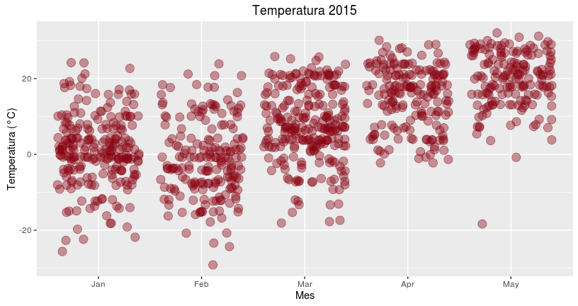
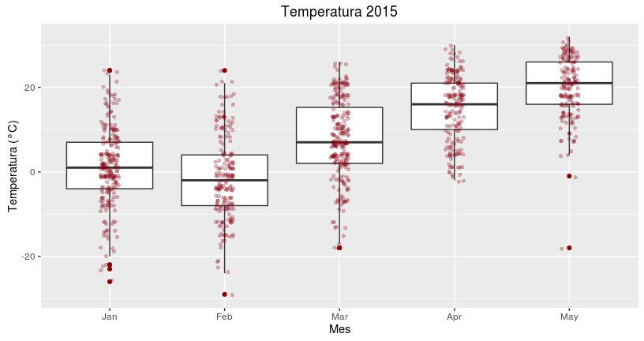

# Taller avanzado de R
Adolfo De Unánue T.  
31 de marzo de 2016  

# Introducción

## Repositorio

* Página: `https://github.com/nanounanue/xxvii-congreso-nacional-actuaria-udla/tree/master`

* Repo: `git@github.com:nanounanue/xxvii-congreso-nacional-actuaria-udla.git`

* [Descargar `zip`](https://github.com/nanounanue/xxvii-congreso-nacional-actuaria-udla/archive/master.zip)


## Instalamos los paquetes


```r
instalar <- function(paquete) {
    
    if (!require(paquete,character.only = TRUE, quietly = TRUE, warn.conflicts = FALSE)) {
        install.packages(as.character(paquete), dependecies = TRUE, repos = "http://cran.us.r-project.org")
        library(paquete, character.only = TRUE, quietly = TRUE, warn.conflicts = FALSE)
    }
}

paquetes <- c('lubridate', 'magrittr', 'ggvis', 'dplyr', 'tidyr', 'readr', 'rvest', 
              'ggplot2', 'stringr', 'babynames', 'ggthemes', 'googleVis', 'shiny')

lapply(paquetes, instalar)

options(digits = 3)
```


# Ciencia de datos


## Actividades de la ciencia de datos

1. Leer un conjunto de datos
2. Limpiarlo
3. Manipularlo
4. Explorarlo
4. Guardarlo
4. Modelarlo
4. Comunicarlo
4. Productificarlo

# Pipelines

## `%>%`

Por que anidar, si podemos platicar


```r
# Normalmente
mas <- function(x, y) x + y
por <- function(x, y) x * y

# 2 * 10 + 1
# Dos por 10 mas 1
mas(1, por(2, 10))
```

```
## [1] 21
```


```r
x %>% f(y) -> f(x, y)
x %>% f(y) %>% g(z) -> g(f(x, y), z)
```


```r
# Dos por 10 mas 1
2 %>% 
  por(10) %>%
  mas(1)
```

```
## [1] 21
```


## Dataset

* Vamos a utilizar un conjunto de datos (_data set_) que describe los accidentes en trenes en 2015. 

* Lo obtuve de esta página [FRA Office of Safety Analysis Web Site](http://safetydata.fra.dot.gov/officeofsafety/default.aspx)
    - En el menú de `Downloads` y seleccioné **Accident Data as reported by Railroads**.
    - Elegí los parámetros por default, y pedí que la descarga fuera en formato `TXT` (en realidad es un `csv`).

* Ya se encuentra en la carpeta `data`.

* El significado de cada columna se puede ver en el archivo `accfile_ThruMay2011.pdf` en la carpeta del proyecto.


## Columnas interesantes

 Nos quedaremos con las siguientes columnas

| Nombre de columna | Número de columna | Variable                |
|-------------------+-------------------+-------------------------|
| YEAR              |                16 | year of incident        |
| MONTH             |                17 | month of incident       |
| DAY               |                18 | day of incident         |
| TIMEHR            |                19 | hour  of incident       |
| TIMEMIN           |                20 | minutes of incident     |
| AMPM              |                21 | ampm                    |
| TYPE              |                22 | type of accident        |
| CARS              |                23 | cars hazmat             |
| CARSDMG           |                24 | cars hazmat damaged     |

## Columnas interesantes (cont)
| Nombre de columna | Número de columna | Variable                |
|-------------------+-------------------+-------------------------|
| CARSHZD           |                25 | cars hazmat realeased   |
| EVACUATE          |                26 | persons evacuated       |
| STATION           |                28 | nearest city            |
| STATE             |                30 | state  (FIPS)           |
| TEMP              |                31 | temperature             |
| VISIBLTY          |                32 | visibility              |
| WEATHER           |                33 | weather                 |
| TRNSPD            |                34 | train speed             |
| TYPSPD            |                35 | train speed type        |
| TRNDIR            |                37 | train direction         |

## Columnas interesantes (cont)

| Nombre de columna | Número de columna | Variable                |
|-------------------+-------------------+-------------------------|
| TONS              |                38 | tonnage                 |
| TYPEQ             |                39 | train type              |
| RRCAR1            |                45 | car initials 1          |
| CARNBR1           |                46 | car number 1            |
| POSITON1          |                47 | car position in train 1 |
| LOADED1           |                48 | car loaded or not 1     |
| RRCAR2            |                49 | car initials 2          |
| CARNBR2           |                50 | car number 2            |
| POSITON2          |                51 | car position in train 1 |
| LOADED2           |                52 | car loaded or not 1     |

## Columnas interesantes (cont)
| Nombre de columna | Número de columna | Variable                |
|-------------------+-------------------+-------------------------|
| CAUSE             |                75 | primary cause           |
| CAUSE2            |                76 | secondary cause         |
| CASKLD            |                79 | killed                  |
| CASINJ            |                80 | injured                 |
| ACCDMG            |                85 | total damage ($)        |
| CNTYCD            |               115 | county (FIPS)           |
| ALCOHOL           |               117 | positive alcohol tests  |
| DRUG              |               118 | positive drug tests     |
| Latitude          |               139 | lat                     |
| Longitud          |               140 | long                    |


## Leer

El primer paso es _cargar_ el data set a `R`


```r
(accidents.df <- read_csv(file="data/1417426.txt")) ## Estamos usando el paquete readr
```

```
## Source: local data frame [1,011 x 146]
## 
##    AMTRAK   IYR   IMO RAILROAD   INCDTNO  IYR2  IMO2   RR2 INCDTNO2  IYR3
##     (chr) (int) (chr)    (chr)     (chr) (int) (chr) (chr)    (chr) (int)
## 1      NA    15    05       UP 0515KC002    NA    NA                   15
## 2      NA    15    01     CRSH    113847    NA    NA                   15
## 3      NA    15    01     CRSH    113847    NA    NA                   15
## 4      NA    15    05       UP 0515KC010    NA    NA                   15
## 5      NA    15    05       UP 0515PR003    NA    NA                   15
## 6      NA    15    05       UP 0515PR003    NA    NA                   15
## 7      NA    15    05       UP 0515PR030    NA    NA                   15
## 8      NA    15    03      CSX 000143277    NA    NA                   15
## 9      NA    15    01       UP 0115CB003    NA    NA                   15
## 10     NA    15    01     UPME 0115PR016    NA    NA                   15
## ..    ...   ...   ...      ...       ...   ...   ...   ...      ...   ...
## Variables not shown: IMO3 (chr), RR3 (chr), INCDTNO3 (chr), DUMMY1 (chr),
##   GXID (chr), YEAR (int), MONTH (chr), DAY (chr), TIMEHR (dbl), TIMEMIN
##   (dbl), AMPM (chr), TYPE (chr), CARS (dbl), CARSDMG (dbl), CARSHZD (dbl),
##   EVACUATE (dbl), DIVISION (chr), STATION (chr), MILEPOST (chr), STATE
##   (chr), TEMP (dbl), VISIBLTY (int), WEATHER (int), TRNSPD (chr), TYPSPD
##   (chr), TRNNBR (chr), TRNDIR (int), TONS (dbl), TYPEQ (chr), EQATT (chr),
##   TRKNAME (chr), TRKCLAS (chr), TRKDNSTY (chr), TYPTRK (int), RRCAR1
##   (chr), CARNBR1 (chr), POSITON1 (chr), LOADED1 (chr), RRCAR2 (chr),
##   CARNBR2 (chr), POSITON2 (chr), LOADED2 (chr), HEADEND1 (dbl), MIDMAN1
##   (dbl), MIDREM1 (dbl), RMAN1 (dbl), RREM1 (dbl), HEADEND2 (dbl), MIDMAN2
##   (dbl), MIDREM2 (dbl), RMAN2 (dbl), RREM2 (dbl), LOADF1 (dbl), LOADP1
##   (dbl), EMPTYF1 (dbl), EMPTYP1 (dbl), CABOOSE1 (dbl), LOADF2 (dbl),
##   LOADP2 (dbl), EMPTYF2 (dbl), EMPTYP2 (dbl), CABOOSE2 (dbl), EQPDMG
##   (dbl), TRKDMG (dbl), CAUSE (chr), CAUSE2 (chr), CASKLDRR (dbl), CASINJRR
##   (dbl), CASKLD (dbl), CASINJ (dbl), ACCAUSE (chr), ACCTRK (int), ACCTRKCL
##   (chr), HIGHSPD (chr), ACCDMG (dbl), DUMMY2 (chr), STCNTY (chr), TOTINJ
##   (dbl), DUMMY3 (chr), TOTKLD (dbl), ENGRS (int), FIREMEN (int), CONDUCTR
##   (int), BRAKEMEN (int), ENGHR (chr), ENGMIN (chr), CDTRHR (chr), CDTRMIN
##   (chr), JOINTCD (int), REGION (int), DUMMY4 (chr), TYPRR (dbl), DUMMY5
##   (chr), RRDIV (chr), METHOD (chr), NARRLEN (dbl), DUMMY6 (chr), YEAR4
##   (int), RREMPKLD (dbl), RREMPINJ (dbl), PASSKLD (dbl), PASSINJ (dbl),
##   OTHERKLD (dbl), OTHERINJ (dbl), COUNTY (chr), CNTYCD (chr), ALCOHOL
##   (chr), DRUG (chr), DUMMY7 (chr), PASSTRN (chr), SSB1 (chr), SSB2 (chr),
##   NARR1 (chr), NARR2 (chr), NARR3 (chr), NARR4 (chr), NARR5 (chr), NARR6
##   (chr), NARR7 (chr), NARR8 (chr), NARR9 (chr), NARR10 (chr), NARR11
##   (chr), NARR12 (chr), NARR13 (chr), NARR14 (chr), NARR15 (chr), RCL
##   (int), Latitude (dbl), Longitud (dbl), SIGNAL (int), MOPERA (int),
##   ADJUNCT1 (chr), ADJUNCT2 (chr), ADJUNCT3 (chr), SUBDIV (chr)
```

## Ejercicio

- ¿Cuántos accidentes están reportados? 

- ¿Cuántas variables tiene el data set?

## Leer

La estructura del data set se puede obtener con `glimpse`


```r
glimpse(accidents.df)
```

```
## Observations: 1,011
## Variables: 146
## $ AMTRAK   (chr) NA, NA, NA, NA, NA, NA, NA, NA, NA, NA, NA, NA, NA, N...
## $ IYR      (int) 15, 15, 15, 15, 15, 15, 15, 15, 15, 15, 15, 15, 15, 1...
## $ IMO      (chr) "05", "01", "01", "05", "05", "05", "05", "03", "01",...
## $ RAILROAD (chr) "UP", "CRSH", "CRSH", "UP", "UP", "UP", "UP", "CSX", ...
## $ INCDTNO  (chr) "0515KC002", "113847", "113847", "0515KC010", "0515PR...
## $ IYR2     (int) NA, NA, NA, NA, NA, NA, NA, NA, NA, NA, NA, NA, NA, N...
## $ IMO2     (chr) NA, NA, NA, NA, NA, NA, NA, NA, NA, NA, NA, NA, NA, N...
## $ RR2      (chr) "", "", "", "", "", "", "", "", "", "", "", "", "", "...
## $ INCDTNO2 (chr) "", "", "", "", "", "", "", "", "", "", "", "", "", "...
## $ IYR3     (int) 15, 15, 15, 15, 15, 15, 15, 15, 15, 15, 15, 15, 15, 1...
## $ IMO3     (chr) "05", "01", "01", "05", "05", "05", "05", "03", "01",...
## $ RR3      (chr) "UP", "CRSH", "CRSH", "UP", "UP", "UP", "UP", "CSX", ...
## $ INCDTNO3 (chr) "0515KC002", "113847", "113847", "0515KC010", "0515PR...
## $ DUMMY1   (chr) NA, NA, NA, NA, NA, NA, NA, NA, NA, NA, NA, NA, NA, N...
## $ GXID     (chr) "", "", "", "605800K", "", "", "", "", "", "", "", ""...
## $ YEAR     (int) 15, 15, 15, 15, 15, 15, 15, 15, 15, 15, 15, 15, 15, 1...
## $ MONTH    (chr) "05", "01", "01", "05", "05", "05", "05", "03", "01",...
## $ DAY      (chr) "08", "13", "13", "27", "01", "01", "29", "14", "05",...
## $ TIMEHR   (dbl) 2, 9, 9, 8, 10, 10, 12, 9, 5, 10, 12, 8, 4, 4, 3, 10,...
## $ TIMEMIN  (dbl) 40, 10, 10, 50, 30, 30, 10, 50, 10, 39, 30, 30, 30, 5...
## $ AMPM     (chr) "AM", "AM", "AM", "PM", "AM", "AM", "PM", "PM", "PM",...
## $ TYPE     (chr) "01", "05", "05", "07", "12", "12", "01", "09", "11",...
## $ CARS     (dbl) 0, 0, 0, 2, 0, 0, 0, 0, 0, 0, 0, 0, 0, 0, 0, 3, 0, 0,...
## $ CARSDMG  (dbl) 0, 0, 0, 0, 0, 0, 0, 0, 0, 0, 0, 0, 0, 0, 0, 0, 0, 0,...
## $ CARSHZD  (dbl) 0, 0, 0, 0, 0, 0, 0, 0, 0, 0, 0, 0, 0, 0, 0, 0, 0, 0,...
## $ EVACUATE (dbl) 0, 0, 0, 0, 0, 0, 0, 0, 0, 0, 0, 0, 0, 0, 0, 0, 0, 0,...
## $ DIVISION (chr) "", "", "", "", "", "", "", "", "", "", "", "", "", "...
## $ STATION  (chr) "KANSAS CITY", "NEWARK", "NEWARK", "MINNEOLA", "NORTH...
## $ MILEPOST (chr) "MO", "010.60", "010.60", "370.29", "14.1", "14.1", "...
## $ STATE    (chr) "29", "34", "34", "20", "17", "17", "17", "54", "19",...
## $ TEMP     (dbl) 62, 23, 23, 55, 65, 65, 80, 37, 5, 23, 50, 51, 70, 56...
## $ VISIBLTY (int) 4, 2, 2, 4, 2, 2, 2, 4, 4, 2, 2, 4, 2, 4, 4, 4, 2, 1,...
## $ WEATHER  (int) 3, 2, 2, 3, 1, 1, 3, 1, 2, 2, 1, 2, 2, 2, 1, 1, 1, 1,...
## $ TRNSPD   (chr) "002", "000", "001", "052", "000", "010", "006", "005...
## $ TYPSPD   (chr) "E", "E", "E", "R", "E", "E", "E", "E", "E", "R", "R"...
## $ TRNNBR   (chr) "YKC2", "NOTR", "FO49", "ILXD", "", "", "YCH0", "U286...
## $ TRNDIR   (int) 3, 3, 3, 3, NA, 3, 2, 3, 3, 3, 2, 1, 1, 2, 1, 1, 3, 3...
## $ TONS     (dbl) 6984, 0, 0, 7290, 136, 436, 303, 21061, 18090, 1460, ...
## $ TYPEQ    (chr) "7", "5", "7", "1", "5", "6", "1", "1", "1", "7", "4"...
## $ EQATT    (chr) "Y", "N", "Y", "Y", "N", "N", "Y", "Y", "Y", "Y", "Y"...
## $ TRKNAME  (chr) "EAST BOWL LEAD", "OI TRACK 8", "OI TRACK 6", "SINGLE...
## $ TRKCLAS  (chr) "1", "1", "1", "4", "1", "1", "1", "3", "4", "1", "4"...
## $ TRKDNSTY (chr) "", "0010", "0010", "42.6", "", "", "", "0030.5", "81...
## $ TYPTRK   (int) 2, 2, 2, 1, 2, 2, 2, 1, 1, 2, 1, 4, 1, 1, 2, 2, 2, 2,...
## $ RRCAR1   (chr) "UTLX", "ADMX", "ADMX", "UP", "MBLX", "BLHX", "ETTX",...
## $ CARNBR1  (chr) "662028", "028199", "025120", "004138", "053428", "02...
## $ POSITON1 (chr) "058", "001", "001", "001", "001", "001", "002", "144...
## $ LOADED1  (chr) "Y", "Y", "Y", "", "Y", "N", "N", "Y", "", "", "Y", "...
## $ RRCAR2   (chr) "", "", "", "", "", "", "", "", "UP", "", "", "", "",...
## $ CARNBR2  (chr) "", "", "", "", "", "", "", "", "007004", "", "", "",...
## $ POSITON2 (chr) "000", "000", "000", "000", "000", "000", "000", "000...
## $ LOADED2  (chr) "", "", "", "", "", "", "", "", "", "", "", "", "", "...
## $ HEADEND1 (dbl) 2, 0, 2, 4, 0, 0, 1, 3, 2, 1, 2, 2, 2, 2, 2, 4, 0, 0,...
## $ MIDMAN1  (dbl) 0, 0, 0, 0, 0, 0, 0, 0, 0, 0, 0, 0, 0, 0, 0, 0, 0, 0,...
## $ MIDREM1  (dbl) 0, 0, 0, 0, 0, 0, 0, 0, 0, 0, 0, 0, 0, 0, 0, 0, 0, 0,...
## $ RMAN1    (dbl) 0, 0, 0, 0, 0, 0, 0, 0, 1, 0, 0, 0, 0, 0, 0, 0, 0, 0,...
## $ RREM1    (dbl) 0, 0, 0, 0, 0, 0, 0, 0, 0, 0, 0, 0, 0, 0, 0, 0, 0, 0,...
## $ HEADEND2 (dbl) 0, 0, 0, 0, 0, 0, 0, 0, 0, 0, 0, 1, 0, 0, 0, 0, 0, 0,...
## $ MIDMAN2  (dbl) 0, 0, 0, 0, 0, 0, 0, 0, 0, 0, 0, 0, 0, 0, 0, 0, 0, 0,...
## $ MIDREM2  (dbl) 0, 0, 0, 0, 0, 0, 0, 0, 0, 0, 0, 0, 0, 0, 0, 0, 0, 0,...
## $ RMAN2    (dbl) 0, 0, 0, 0, 0, 0, 0, 0, 0, 0, 0, 0, 0, 0, 0, 0, 0, 0,...
## $ RREM2    (dbl) 0, 0, 0, 0, 0, 0, 0, 0, 0, 0, 0, 0, 0, 0, 0, 0, 0, 0,...
## $ LOADF1   (dbl) 50, 1, 1, 130, 1, 2, 4, 150, 135, 9, 40, 0, 0, 108, 1...
## $ LOADP1   (dbl) 0, 0, 0, 0, 0, 0, 0, 0, 0, 0, 0, 0, 0, 0, 0, 0, 0, 0,...
## $ EMPTYF1  (dbl) 6, 0, 0, 0, 0, 1, 0, 0, 0, 4, 4, 60, 3, 0, 6, 57, 0, ...
## $ EMPTYP1  (dbl) 0, 0, 0, 0, 0, 0, 0, 0, 0, 0, 0, 0, 0, 0, 0, 0, 0, 0,...
## $ CABOOSE1 (dbl) 0, 0, 0, 0, 0, 0, 0, 0, 0, 0, 0, 0, 0, 0, 0, 0, 0, 0,...
## $ LOADF2   (dbl) 2, 1, 1, 0, 0, 0, 3, 0, 0, 5, 0, 0, 0, 3, 4, 0, 0, 0,...
## $ LOADP2   (dbl) 0, 0, 0, 0, 0, 0, 0, 0, 0, 0, 0, 0, 0, 0, 0, 0, 0, 0,...
## $ EMPTYF2  (dbl) 0, 0, 0, 0, 0, 0, 0, 0, 0, 0, 0, 0, 0, 0, 4, 1, 0, 0,...
## $ EMPTYP2  (dbl) 0, 0, 0, 0, 0, 0, 0, 0, 0, 0, 0, 0, 0, 0, 0, 0, 0, 0,...
## $ CABOOSE2 (dbl) 0, 0, 0, 0, 0, 0, 0, 0, 0, 0, 0, 0, 0, 0, 0, 0, 0, 0,...
## $ EQPDMG   (dbl) 14436, 10073, 7030, 62699, 73896, 9289, 996, 130173, ...
## $ TRKDMG   (dbl) 1000, 0, 150, 45795, 0, 0, 15000, 50, 0, 93835, 0, 23...
## $ CAUSE    (chr) "M204", "S006", "S006", "M399", "H601", "H601", "T110...
## $ CAUSE2   (chr) "", "", "", "", "", "", "", "M101", "", "", "", "", "...
## $ CASKLDRR (dbl) 0, 0, 0, 0, 0, 0, 0, 0, 0, 0, 0, 0, 0, 0, 0, 0, 0, 0,...
## $ CASINJRR (dbl) 0, 0, 0, 0, 0, 0, 0, 0, 0, 0, 0, 0, 3, 0, 0, 0, 0, 0,...
## $ CASKLD   (dbl) 0, 0, 0, 0, 0, 0, 0, 0, 0, 0, 0, 0, 0, 0, 0, 0, 0, 0,...
## $ CASINJ   (dbl) 0, 0, 0, 0, 0, 0, 0, 0, 0, 0, 1, 0, 3, 0, 0, 0, 0, 0,...
## $ ACCAUSE  (chr) "M204", "S006", "S006", "M399", "H601", "H601", "T110...
## $ ACCTRK   (int) 2, 2, 2, 1, 2, 2, 2, 1, 1, 2, 1, 4, 1, 1, 2, 2, 2, 2,...
## $ ACCTRKCL (chr) "1", "1", "1", "4", "1", "1", "1", "3", "4", "1", "4"...
## $ HIGHSPD  (chr) "002", "001", "001", "052", "010", "010", "006", "005...
## $ ACCDMG   (dbl) 15436, 17253, 17253, 108494, 83185, 83185, 15996, 130...
## $ DUMMY2   (chr) NA, NA, NA, NA, NA, NA, NA, NA, NA, NA, NA, NA, NA, N...
## $ STCNTY   (chr) "29C095", "34C013", "34C013", "20C025", "17C031", "17...
## $ TOTINJ   (dbl) 0, 0, 0, 0, 0, 0, 0, 0, 0, 0, 0, 0, 3, 0, 0, 0, 0, 0,...
## $ DUMMY3   (chr) "000000", "000000", "000000", "000000", "000000", "00...
## $ TOTKLD   (dbl) 0, 0, 0, 0, 0, 0, 0, 0, 0, 0, 0, 0, 0, 0, 0, 0, 0, 0,...
## $ ENGRS    (int) 3, 0, 1, 1, 0, 0, 1, 1, 1, 1, 1, 1, 1, 1, 0, 1, 0, 0,...
## $ FIREMEN  (int) 0, 0, 0, 0, 0, 0, 0, 0, 0, 0, 0, 0, 0, 0, 0, 0, 0, 0,...
## $ CONDUCTR (int) 0, 0, 1, 1, 0, 0, 0, 1, 1, 0, 0, 2, 1, 1, 1, 0, 0, 0,...
## $ BRAKEMEN (int) 0, 0, 0, 0, 0, 0, 1, 0, 0, 1, 1, 0, 0, 1, 1, 1, 0, 0,...
## $ ENGHR    (chr) "06", "", "10", "05", "", "", "05", "04", "03", "04",...
## $ ENGMIN   (chr) "10", "", "10", "50", "", "", "10", "50", "40", "09",...
## $ CDTRHR   (chr) "", "", "10", "05", "", "", "", "04", "03", "", "", "...
## $ CDTRMIN  (chr) "", "", "10", "50", "", "", "", "50", "40", "", "", "...
## $ JOINTCD  (int) 1, 3, 1, 1, 3, 1, 1, 1, 1, 1, 3, 1, 1, 2, 1, 1, 1, 1,...
## $ REGION   (int) 6, 1, 1, 6, 4, 4, 4, 2, 6, 4, 5, 5, 5, 6, 3, 4, 4, 4,...
## $ DUMMY4   (chr) NA, NA, NA, NA, NA, NA, NA, NA, NA, NA, NA, NA, NA, N...
## $ TYPRR    (dbl) 1, 1, 1, 1, 1, 1, 1, 1, 1, 3, 1, 1, 1, 3, 1, 1, 1, 1,...
## $ DUMMY5   (chr) NA, NA, NA, NA, NA, NA, NA, NA, NA, NA, NA, NA, NA, N...
## $ RRDIV    (chr) "", "", "", "", "", "", "", "", "", "", "", "", "", "...
## $ METHOD   (chr) "", "", "", "", "", "", "", "", "", "", "", "", "", "...
## $ NARRLEN  (dbl) 76, 90, 90, 96, 153, 153, 123, 153, 427, 121, 288, 44...
## $ DUMMY6   (chr) NA, NA, NA, NA, NA, NA, NA, NA, NA, NA, NA, NA, NA, N...
## $ YEAR4    (int) 2015, 2015, 2015, 2015, 2015, 2015, 2015, 2015, 2015,...
## $ RREMPKLD (dbl) 0, 0, 0, 0, 0, 0, 0, 0, 0, 0, 0, 0, 0, 0, 0, 0, 0, 0,...
## $ RREMPINJ (dbl) 0, 0, 0, 0, 0, 0, 0, 0, 0, 0, 0, 0, 2, 0, 0, 0, 0, 0,...
## $ PASSKLD  (dbl) 0, 0, 0, 0, 0, 0, 0, 0, 0, 0, 0, 0, 0, 0, 0, 0, 0, 0,...
## $ PASSINJ  (dbl) 0, 0, 0, 0, 0, 0, 0, 0, 0, 0, 0, 0, 0, 0, 0, 0, 0, 0,...
## $ OTHERKLD (dbl) 0, 0, 0, 0, 0, 0, 0, 0, 0, 0, 0, 0, 0, 0, 0, 0, 0, 0,...
## $ OTHERINJ (dbl) 0, 0, 0, 0, 0, 0, 0, 0, 0, 0, 0, 0, 1, 0, 0, 0, 0, 0,...
## $ COUNTY   (chr) "JACKSON", "ESSEX", "ESSEX", "CLARK", "COOK", "COOK",...
## $ CNTYCD   (chr) "095", "013", "013", "025", "031", "031", "031", "025...
## $ ALCOHOL  (chr) "", "", "", "", "", "", "", "", "", "", "00", "", "",...
## $ DRUG     (chr) "", "", "", "", "", "", "", "", "", "", "00", "", "",...
## $ DUMMY7   (chr) "", "", "", "", "", "", "", "", "", "", "", "", "", "...
## $ PASSTRN  (chr) "N", "N", "N", "N", "N", "N", "N", "N", "N", "N", "N"...
## $ SSB1     (chr) "OTH", "OTH", "OTH", "CWR", "OTH", "OTH", "OTH", "", ...
## $ SSB2     (chr) NA, NA, NA, NA, NA, NA, NA, NA, NA, NA, NA, NA, NA, N...
## $ NARR1    (chr) "YKC20R-07 WHILE HUMPING, DERAILED 2 CARS DUE TO AN I...
## $ NARR2    (chr) "", "", "", "", "OWL 47 WHEN THEY HAD A HIGH IMPACT W...
## $ NARR3    (chr) "", "", "", "", "", "", "", "", "Y EXTINGUISHED THE F...
## $ NARR4    (chr) "", "", "", "", "", "", "", "", ".  A SMALL AMOUNT OF...
## $ NARR5    (chr) "", "", "", "", "", "", "", "", "EL THAT HAD HIT THE ...
## $ NARR6    (chr) "", "", "", "", "", "", "", "", "", "", "", "", "", "...
## $ NARR7    (chr) "", "", "", "", "", "", "", "", "", "", "", "", "", "...
## $ NARR8    (chr) "", "", "", "", "", "", "", "", "", "", "", "", "", "...
## $ NARR9    (chr) "", "", "", "", "", "", "", "", "", "", "", "", "", "...
## $ NARR10   (chr) "", "", "", "", "", "", "", "", "", "", "", "", "", "...
## $ NARR11   (chr) "", "", "", "", "", "", "", "", "", "", "", "", "", "...
## $ NARR12   (chr) "", "", "", "", "", "", "", "", "", "", "", "", "", "...
## $ NARR13   (chr) "", "", "", "", "", "", "", "", "", "", "", "", "", "...
## $ NARR14   (chr) "", "", "", "", "", "", "", "", "", "", "", "", "", "...
## $ NARR15   (chr) "", "", "", "", "", "", "", "", "", "", "", "", "", "...
## $ RCL      (int) 3, 0, 0, 0, 0, 0, 1, 0, 0, 0, 0, 0, 0, 0, 2, 0, 0, 0,...
## $ Latitude (dbl) 39.1, 40.7, 40.7, 37.4, 41.9, 41.9, 41.6, 37.8, 42.0,...
## $ Longitud (dbl) -94.5, -74.1, -74.1, -100.0, -87.9, -87.9, -87.6, -80...
## $ SIGNAL   (int) 2, 2, 2, 1, 2, 2, 2, 1, 1, 2, 1, 2, 1, 1, 2, 2, 2, 2,...
## $ MOPERA   (int) 5, 5, 5, 1, 5, 5, 5, 1, 1, 5, 1, 5, 2, 1, 5, 5, 5, 5,...
## $ ADJUNCT1 (chr) "", "K", "K", "Q", "", "", "", "Q", "", "", "Q", "K",...
## $ ADJUNCT2 (chr) "", "", "", "", "", "", "", "", "", "", "", "L", "", ...
## $ ADJUNCT3 (chr) "", "", "", "", "", "", "", "", "", "", "", "", "", "...
## $ SUBDIV   (chr) "K C METRO NEFF YD", "NORTH JERSEY", "NORTH JERSEY", ...
```

## Leer

* `R` también puede leer datos desde la web, scrapear, usar bases de datos, leer archivos de Excel, etc. 

* Algo de esto usaremos en los casos de estudio

# Limpieza

## Manipular

* Como puedes observar, los datos (cuando existen), regularmente son una porqueria. Es necesario **manipularlos**: Limpiarlos  y acomodarlos para que puedan servir al análisis.

* Para esto utilizaremos dos _bibliotecas_ de funciones: `dplyr` y `tidyr`. 

* Siempre es útil tener a la mano [esto](https://docs.google.com/viewer?url=https%3A%2F%2Fwww.rstudio.com%2Fwp-content%2Fuploads%2F2015%2F02%2Fdata-wrangling-cheatsheet.pdf).

## Manipular

* `dplyr` maneja 5 verbos para la manipulación de los datos.

    - `filter`
    - `select`
    - `mutate`
    - `arrange`
    - `summarize`

Además `dplyr` popularizó el operador de _entubamiento_ : `%>%`.
    
## Manipular

Nuestro plan de batalla será el siguiente:

1. Quitar las columnas que no nos parecen interesantes.
2. Ajustar el _tipo_ de las columnas para su mejor representación.
3. Crear y/o limpiar columnas

## Manipular


```r
accidents <- accidents.df %>%
    select(YEAR:EVACUATE, STATION, STATE:TYPSPD, TRNDIR:TYPEQ, 
           RRCAR1:LOADED2, CAUSE, CAUSE2, CASKLD, CASINJ, 
           ACCDMG, CNTYCD, ALCOHOL, DRUG, Latitude, Longitud)
```

## Ejercicio

- Renombra las columnas para que tengan sentido:

- Todo a minúsculas

- `car_initials_1=RRCAR1, car_number_1=CARNBR1, car_initials_2=RRCAR2, car_number_2=CARNBR2,`
  `accident_type=TYPE, cars_hazmat=CARS, cars_hazmat_damaged=CARSDMG, cars_hazmat_realeased=CARSHZD,`
  `persons_evacuated=EVACUATE, nearest_city=STATION, state=STATE, temperature=TEMP, visibility=VISIBLTY,`
  `weather=WEATHER, train_speed=TRNSPD, train_speed_type=TYPSPD, train_direction=TRNDIR, tonnage=TONS,` 
  `train_type=TYPEQ, primary_cause=CAUSE, secondary_cause=CAUSE2, killed=CASKLD, injured=CASINJ, lat=Latitude, long=Longitud`
  `car_position_1=POSITON1, car_loaded_1=LOADED1, car_position_2=POSITON2, car_loaded_2=LOADED2, total_damage=ACCDMG,`
  `county=CNTYCD, alcohol=ALCOHOL, drugs=DRUG`


## Manipular

Muchas variables son categóricas, pero nuestro _data set_ las tiene como caracteres. Arreglémos eso.


```r
accidents <- accidents %>% 
  mutate(car_id_1 = paste(car_initials_1, car_number_1, sep="-"), 
         car_id_2 = paste(car_initials_2, car_number_2, sep="-"),
         hour = ifelse(ampm=='AM', hour, hour+12),
         timestamp = ymd_hm(paste(year,month,day,str_pad(hour, 2, 'left', '0'), str_pad(minutes, 2, 'left', '0'))),
         year = year(timestamp), month=month(timestamp, label=TRUE, abbr=TRUE), 
         day=day(timestamp), wday=wday(timestamp, label=TRUE, abbr=TRUE), hour=hour(timestamp), minutes=minute(timestamp)) %>% 
         mutate_each(funs(as.factor), c(ampm, nearest_city, state, car_id_1, car_id_2, accident_type))
```

* Ejercicio: ¿Qué otras variables son categóricas? Modifica el código para que así lo sea.
* Ejercicio: Usa el pdf y agrega etiquetas a las variables categóricas
* Ejercicio: ¿Cómo removemos `car.initials.x` y `car.number.x`?
* Ejercicio: La temperatura está en Fahrenheit ¿Cómo la transformarías a Celsius?


## Guardar

Con lo que hemos hecho, es mejor guardar el avance que llevamos. Así, si posteriormente queremos regresar a este estado (si nos equivocamos o algo parecido) podrémos hacerlo.


```r
saveRDS(object = accidents, file="clean/accidents.rds")
```

Esto lo guardará en binario, en un formato específico de `R`.

_Nota que_ `R` _también podrá guardar en Excel, csv, bases de datos, etc._

# Análisis

## Explorar: Estadistica descriptiva

Ahora estamos listos para analizar, el primer paso es limpiar nuestro ambiente (no necesario, pero ampliamente recomendado)


```r
#rm(list=ls())
```

Y luego leer nuestro `data.frame`


```r
accidents <- readRDS("clean/accidents.rds")
```

## Explorar: Estadistica descriptiva

Primero veamos el _data set_ completo


```r
# summary(accidents)
```

## Explorar: Estadistica descriptiva

Pero es posible responder preguntas más específicas:

* ¿Cuántos accidentes por estado y por tipo?


```r
accidents %>%
  group_by(state, accident_type) %>%
  summarize(n = n())
```

```
## Source: local data frame [173 x 3]
## Groups: state [?]
## 
##     state accident_type     n
##    (fctr)        (fctr) (int)
## 1      01            01    20
## 2      01            04     6
## 3      01            05     3
## 4      01            07     1
## 5      01            12     3
## 6      02            13     1
## 7      04            01     2
## 8      04            07     3
## 9      04            09     1
## 10     04            11     1
## ..    ...           ...   ...
```

## Explorar: Estadistica descriptiva

* ¿Cuál es el Top 5 de estados por accidentes?


```r
accidents %>%
  group_by(state) %>%
  summarize(n = n()) %>%
  arrange(desc(n)) %>%
  head()
```

```
## Source: local data frame [6 x 2]
## 
##    state     n
##   (fctr) (int)
## 1     48   128
## 2     17   124
## 3     06    52
## 4     18    52
## 5     42    38
## 6     36    36
```

## Explorar: Estadistica descriptiva

* ¿Cuál es el mes con más accidentes? ¿Cuál es la temperatura promedio?


```r
accidents %>%
  group_by(month) %>%
  summarise(n = n(), mean_temperature = mean(temperature))
```

```
## Source: local data frame [5 x 3]
## 
##    month     n mean_temperature
##   (fctr) (int)            (dbl)
## 1    Jan   229             1.11
## 2    Feb   189            -1.28
## 3    Mar   244             7.69
## 4    Apr   181            15.11
## 5    May   168            19.76
```

## Explorar: Estadistica descriptiva

**Ejercicio:** 

- ¿Cuál es el estado con más muertes? 
- ¿Con más heridos? 
- ¿La hora con mayor accidentes? 

## Exploración visual

Aunque ya vimos el sistema básico de graficación de `R`, ahora veremos dos _bibliotecas_ muy potentes: 

* `ggplot`
* `ggvis`

Ambas están basadas en algo que se llama **gramática de graficación** y la idea principal es estar agregando capa a capa los elementos de una gráfica (datos, ejes, metadata, etc)


## Explorar: ggplot 

Empecemos con algo sencillo: Temperatura por mes

```r
ggplot(data = accidents, aes(x=month, y=temperature)) + 
         geom_point(alpha=.4, size=4, color="#880011", position=position_jitter()) + 
           labs(x="Mes", y ="Temperatura (°C)", title="Temperatura 2015") 
```


## Explorar: ggplot 

\


## Explorar: ggplot 

Para esta gráfica quizá es mejor mostrar un _boxplot_


```r
ggplot(data = accidents, aes(x=month, y=temperature)) + 
         geom_boxplot(outlier.colour = "blue") + 
           labs(x="Mes", y ="Temperatura (°C)", title="Temperatura 2015")
```


## Explorar: ggplot 

\


## Explorar: ggplot 


Pero extraño los puntos de temperatura...


```r
ggplot(data = accidents, aes(x=month, y=temperature)) + 
    geom_boxplot(outlier.colour = "darkred") + 
    geom_jitter(alpha=0.3, shape=16, position=position_jitter(0.2), color="#880011") + 
    labs(x="Mes", y ="Temperatura (°C)", title ="Temperatura 2015")
```

## Explorar: ggplot 

\


## Explorar: ggplot 

Si no nos gusta el _tema_ de la gráfica, podemos cambiarlo a uno que más nos guste. 

Los diferentes temas se pueden ver [aquí](https://github.com/jrnold/ggthemes).

## Explorar: ggplot 


```r
ggplot(data = accidents, aes(x=month, y=temperature)) + 
         geom_boxplot(outlier.colour = "darkred") + geom_jitter(alpha=0.3, shape=16, position=position_jitter(0.2), color="#880011") +
           labs(x="Mes", y ="Temperatura (°C)", title = "Temperatura 2015") + theme_hc()
```


## Explorar: ggplot 

\


## Explorar: ggplot


```r
ggplot(data = accidents, aes(x=accident_type, y=killed)) + 
    geom_boxplot(outlier.colour = "darkred") +
    labs(x="Tipo de Accidente", y ="Decesos", title="Decesos por tipo de accidente") + 
    theme_hc()
```

## Explorar: ggplot

\


## Explorar: ggplot

Es posible usar `dplyr` con `ggplot`


```r
accidents %>%
    group_by(state) %>% 
    summarize(n_obs = n()) %>%  
    arrange(desc(n_obs)) %>%
    ggplot(aes(x=state, y = n_obs)) + 
    geom_bar(stat="identity") + theme_hc() + 
    labs(y="Número de Accidentes", x="Estado", title="Accidentes por Estado")
```


## Explorar: ggplot

\


## Explorar: ggplot

**Ejercicio**: ¿Cómo arreglarías la gráfica de *Decesos por tipo de accidente*?

**Ejercicio**: Toma un ejemplo de la sección de análisis exploratorio y grafícalo.


## Explorar: ggplot

Podemos profundizar el análisis, dividiendo por tipo de accidente


```r
accidents %>%
  group_by(state, accident_type) %>% summarize(n_obs = n()) %>%  arrange(desc(n_obs)) %>%
  ggplot(aes(x=state, y = n_obs)) + geom_bar(stat="identity") +  
  labs(x="Estados", y="Número de Accidentes", title="Tipos de accidente por estado") + 
  facet_wrap(~accident_type)
```


## Explorar: ggplot

\


## Explorar: ggvis

- `ggvis` es un paquete nuevo, pero es el futuro de `R` para graficar

- `ggvis` soporta `pipelines` como lo hace `dplyr`y `tidyr`

- Es reactivo (como `shiny`)


## Explorar: ggvis

Observa como es más natural integrar `ggvis` que `ggplot` con el operator `%>%`


```r
accidents %>%
    group_by(state) %>% 
    summarize(n_obs = n()) %>%  
    arrange(desc(n_obs)) %>%
    ggvis(~state, ~n_obs, fill := 'green') %>%
    layer_bars()
```


## Explorar: ggvis


<!--html_preserve--><div id="plot_id275014187-container" class="ggvis-output-container">
<div id="plot_id275014187" class="ggvis-output"></div>
<div class="plot-gear-icon">
<nav class="ggvis-control">
<a class="ggvis-dropdown-toggle" title="Controls" onclick="return false;"></a>
<ul class="ggvis-dropdown">
<li>
Renderer: 
<a id="plot_id275014187_renderer_svg" class="ggvis-renderer-button" onclick="return false;" data-plot-id="plot_id275014187" data-renderer="svg">SVG</a>
 | 
<a id="plot_id275014187_renderer_canvas" class="ggvis-renderer-button" onclick="return false;" data-plot-id="plot_id275014187" data-renderer="canvas">Canvas</a>
</li>
<li>
<a id="plot_id275014187_download" class="ggvis-download" data-plot-id="plot_id275014187">Download</a>
</li>
</ul>
</nav>
</div>
</div>
<script type="text/javascript">
var plot_id275014187_spec = {
  "data": [
    {
      "name": ".0/count1/stack2",
      "format": {
        "type": "csv",
        "parse": {
          "stack_lwr_": "number",
          "stack_upr_": "number"
        }
      },
      "values": "\"x_\",\"stack_lwr_\",\"stack_upr_\"\n\"01\",0,33\n\"02\",0,1\n\"04\",0,8\n\"05\",0,22\n\"06\",0,52\n\"08\",0,19\n\"09\",0,1\n\"10\",0,2\n\"11\",0,4\n\"12\",0,8\n\"13\",0,27\n\"16\",0,5\n\"17\",0,124\n\"18\",0,52\n\"19\",0,14\n\"20\",0,32\n\"21\",0,11\n\"22\",0,28\n\"23\",0,4\n\"24\",0,8\n\"25\",0,9\n\"26\",0,11\n\"27\",0,16\n\"28\",0,13\n\"29\",0,22\n\"30\",0,10\n\"31\",0,33\n\"32\",0,5\n\"34\",0,32\n\"35\",0,7\n\"36\",0,36\n\"37\",0,13\n\"38\",0,9\n\"39\",0,34\n\"40\",0,13\n\"41\",0,9\n\"42\",0,38\n\"44\",0,2\n\"45\",0,11\n\"46\",0,3\n\"47\",0,25\n\"48\",0,128\n\"49\",0,8\n\"51\",0,15\n\"53\",0,13\n\"54\",0,10\n\"55\",0,16\n\"56\",0,15"
    },
    {
      "name": "scale/x",
      "format": {
        "type": "csv",
        "parse": {}
      },
      "values": "\"domain\"\n\"01\"\n\"02\"\n\"04\"\n\"05\"\n\"06\"\n\"08\"\n\"09\"\n\"10\"\n\"11\"\n\"12\"\n\"13\"\n\"16\"\n\"17\"\n\"18\"\n\"19\"\n\"20\"\n\"21\"\n\"22\"\n\"23\"\n\"24\"\n\"25\"\n\"26\"\n\"27\"\n\"28\"\n\"29\"\n\"30\"\n\"31\"\n\"32\"\n\"34\"\n\"35\"\n\"36\"\n\"37\"\n\"38\"\n\"39\"\n\"40\"\n\"41\"\n\"42\"\n\"44\"\n\"45\"\n\"46\"\n\"47\"\n\"48\"\n\"49\"\n\"51\"\n\"53\"\n\"54\"\n\"55\"\n\"56\""
    },
    {
      "name": "scale/y",
      "format": {
        "type": "csv",
        "parse": {
          "domain": "number"
        }
      },
      "values": "\"domain\"\n0\n134.4"
    }
  ],
  "scales": [
    {
      "domain": {
        "data": "scale/x",
        "field": "data.domain"
      },
      "name": "x",
      "type": "ordinal",
      "points": false,
      "padding": 0.1,
      "sort": false,
      "range": "width"
    },
    {
      "name": "y",
      "domain": {
        "data": "scale/y",
        "field": "data.domain"
      },
      "zero": false,
      "nice": false,
      "clamp": false,
      "range": "height"
    }
  ],
  "marks": [
    {
      "type": "rect",
      "properties": {
        "update": {
          "stroke": {
            "value": "#000000"
          },
          "fill": {
            "value": "green"
          },
          "x": {
            "scale": "x",
            "field": "data.x_"
          },
          "y": {
            "scale": "y",
            "field": "data.stack_lwr_"
          },
          "y2": {
            "scale": "y",
            "field": "data.stack_upr_"
          },
          "width": {
            "scale": "x",
            "band": true
          }
        },
        "ggvis": {
          "data": {
            "value": ".0/count1/stack2"
          }
        }
      },
      "from": {
        "data": ".0/count1/stack2"
      }
    }
  ],
  "legends": [],
  "axes": [
    {
      "type": "x",
      "scale": "x",
      "orient": "bottom",
      "layer": "back",
      "grid": true,
      "title": "state"
    },
    {
      "type": "y",
      "scale": "y",
      "orient": "left",
      "layer": "back",
      "grid": true,
      "title": "n_obs"
    }
  ],
  "padding": null,
  "ggvis_opts": {
    "keep_aspect": false,
    "resizable": true,
    "padding": {},
    "duration": 250,
    "renderer": "svg",
    "hover_duration": 0,
    "width": 816,
    "height": 432
  },
  "handlers": null
};
ggvis.getPlot("plot_id275014187").parseSpec(plot_id275014187_spec);
</script><!--/html_preserve-->


## Explorar: ggvis


```r
## Ejemplo tomado de Hadley Wickham 
df <- data.frame(
  x = runif(20),
  y = runif(20),
  dir_x = sample(c(-1, 1), 20, replace = TRUE),
  dir_y = sample(c(-1, 1), 20, replace = TRUE),
  velocity = runif(20, 0, 0.01)
)
mtc1 <- reactive({
  invalidateLater(30, NULL)

  df$x <<- df$x + df$dir_x * df$velocity
  df$y <<- df$y + df$dir_y * df$velocity
  df$dir_x <<- ifelse(df$x > 1, -1, ifelse(df$x < 0, 1, df$dir_x))
  df$dir_y <<- ifelse(df$y > 1, -1, ifelse(df$y < 0, 1, df$dir_y))
  df
})
mtc1 %>% ggvis(x = ~x, y = ~y) %>%
  layer_points() %>%
  scale_numeric("x", domain = c(0, 1)) %>%
  scale_numeric("y", domain = c(0, 1)) %>%
  set_options(duration = 0)
```


## Explorar: ggvis


```
## Warning: Can't output dynamic/interactive ggvis plots in a knitr document.
## Generating a static (non-dynamic, non-interactive) version of the plot.
```

<!--html_preserve--><div id="plot_id263058776-container" class="ggvis-output-container">
<div id="plot_id263058776" class="ggvis-output"></div>
<div class="plot-gear-icon">
<nav class="ggvis-control">
<a class="ggvis-dropdown-toggle" title="Controls" onclick="return false;"></a>
<ul class="ggvis-dropdown">
<li>
Renderer: 
<a id="plot_id263058776_renderer_svg" class="ggvis-renderer-button" onclick="return false;" data-plot-id="plot_id263058776" data-renderer="svg">SVG</a>
 | 
<a id="plot_id263058776_renderer_canvas" class="ggvis-renderer-button" onclick="return false;" data-plot-id="plot_id263058776" data-renderer="canvas">Canvas</a>
</li>
<li>
<a id="plot_id263058776_download" class="ggvis-download" data-plot-id="plot_id263058776">Download</a>
</li>
</ul>
</nav>
</div>
</div>
<script type="text/javascript">
var plot_id263058776_spec = {
  "data": [
    {
      "name": ".0",
      "format": {
        "type": "csv",
        "parse": {
          "x": "number",
          "y": "number"
        }
      },
      "values": "\"x\",\"y\"\n0.240013447632082,0.877453145147301\n0.910625564081129,0.182734997330699\n0.397118012961,0.791185883264989\n0.198915928932838,0.597426201081835\n0.453627026141621,0.37797727572266\n0.759039892349392,0.651216509519145\n0.560980238090269,0.147556985658593\n0.607947248716373,0.786745900737587\n0.915181646896526,0.605349642848596\n0.193166148355231,0.207621955107898\n0.0548597573908046,0.367453585411422\n0.786987488153391,0.973355794786476\n0.0939245662582107,0.559096347626764\n0.313274949965999,0.928060102220625\n0.767826130781323,0.846981703238562\n0.17090381606482,0.795690169269219\n0.705138412003871,0.122150318298955\n0.688533191776369,0.137638728159945\n0.649901364843827,0.888567429122049\n0.895717211924493,0.0876293078344315"
    },
    {
      "name": "scale/x",
      "format": {
        "type": "csv",
        "parse": {
          "domain": "number"
        }
      },
      "values": "\"domain\"\n-0.05\n1.05"
    },
    {
      "name": "scale/y",
      "format": {
        "type": "csv",
        "parse": {
          "domain": "number"
        }
      },
      "values": "\"domain\"\n-0.05\n1.05"
    }
  ],
  "scales": [
    {
      "name": "x",
      "domain": {
        "data": "scale/x",
        "field": "data.domain"
      },
      "zero": false,
      "nice": false,
      "clamp": false,
      "range": "width"
    },
    {
      "name": "y",
      "domain": {
        "data": "scale/y",
        "field": "data.domain"
      },
      "zero": false,
      "nice": false,
      "clamp": false,
      "range": "height"
    }
  ],
  "marks": [
    {
      "type": "symbol",
      "properties": {
        "update": {
          "fill": {
            "value": "#000000"
          },
          "size": {
            "value": 50
          },
          "x": {
            "scale": "x",
            "field": "data.x"
          },
          "y": {
            "scale": "y",
            "field": "data.y"
          }
        },
        "ggvis": {
          "data": {
            "value": ".0"
          }
        }
      },
      "from": {
        "data": ".0"
      }
    }
  ],
  "legends": [],
  "axes": [
    {
      "type": "x",
      "scale": "x",
      "orient": "bottom",
      "layer": "back",
      "grid": true,
      "title": "x"
    },
    {
      "type": "y",
      "scale": "y",
      "orient": "left",
      "layer": "back",
      "grid": true,
      "title": "y"
    }
  ],
  "padding": null,
  "ggvis_opts": {
    "keep_aspect": false,
    "resizable": true,
    "padding": {},
    "renderer": "svg",
    "hover_duration": 0,
    "width": 816,
    "height": 432,
    "duration": 0
  },
  "handlers": null
};
ggvis.getPlot("plot_id263058776").parseSpec(plot_id263058776_spec);
</script><!--/html_preserve-->


## Explorar: Mapa

Usando **GoogleMaps**


```r
plot(accidents %>% 
         mutate(LatLong = paste(lat, long, sep=":")) %>% 
         gvisMap(locationvar="LatLong", tipvar="injured",
                 options = list(showTip=T, showLine=F, enableScrollWheel=TRUE,
                           useMapTypeControl=T, width=1400,height=800))
)
```

# Comunicar


## Comunicar

Este documento en particular, funciona con una extensión del lenguaje [`markdown`](http://es.wikipedia.org/wiki/Markdown), llamada `Rmd`. Esta extensión permite _embeber_ código de `R` y ejecutarlo en el documento. 


## Comunicar

Además el documento que estás viendo utiliza tecnología de `RStudio` llamada [`shiny`](http://shiny.rstudio.com/) la cual agrega interactividad a los documentos, además de permitir aplicaciones web completas.

Puedes aprender más en esta liga [Interactive Documents](http://rmarkdown.rstudio.com/authoring_shiny.html).


# ¿Preguntas?

# ¡Gracias!
